We describe the implementation of a quantum circuit in tequila that simulates chemical systems in first quantization using a plane-wave representation. The construction follows the description of Su et al. @Su_2021, specifically the state preparation of U and V for the qubitization-based algorithm introduced in Section II.C.

We will first give a brief overview over the theoretical background, then the high-level circuit construction. Afterward follows a detailed implementation and a discussion of the results and the cost of the circuit.

## Theoretical Background

The simulation of quantum chemistry is one of the key problems where a speed-up from using quantum computers is expected. Most quantum computing algorithms for quantum chemistry use second quantization, where the number of required qubits scales linearly with the number of spin-orbital basis functions. Here we instead consider a first-quantized formulation.

In the non-relativistic case, the dynamics of molecular systems are governed by the Coulomb Hamiltonian: 
$$
H = T + U + V + T_{\textrm{nuclei}} + V_{\textrm{nuclei}}
$$

where $T$ describes the kinetic energy of the electrons, $U$ the attraction between electrons and nuclei, $V$ the repulsion between electrons and $T_{\textrm{nuclei}}$ and $V_{\textrm{nuclei}}$ describe the same for nuclei. This can be simplified under the Born-Oppenheimer Approximation, where the nuclei are regarded as classical with locations $R_l$. The Hamiltonian then looks like

$$
H(R) = T + U(R) + V + C(R)
$$

where $C(R)$ is a constant given by the Coulomb-Repulsion. This simplification is appropriate for many systems near room temperature.

The electronic structure problem consists of determining the ground-state energies of $H(R)$. These energies define potential energy surfaces that can be helpful to understand chemical reactions. To simulate molecular systems on a computer, they need to be discretized. This can be done in multiple different ways, of which one is the Galerkin representation, where the system is projected onto a well behaved set of basis functions. Common uses for these basis functions are Gaussian orbitals or plane waves. We will only look at the representation with plane waves here.

Plane waves are eigenstates of the momentum operator, and their Galerkin representation has a closed form. The wavefunction is represented in a computational basis encoding electron configurations in N basis functions. A configuration is then specified as $\ket{\phi_1 \phi_2 \dots \phi_n}$.

We use quantum phase estimation to sample eigenvalues of the Hamiltonian. This requires synthesizing a unitary operator whose eigenphases encode the eigenvalues of the Born–Oppenheimer Hamiltonian. Su et al. study two different algorithms for this task, which are qubitization and interaction picture simulation. We only look at the qubitization algorithm here.

### The Qubitization Algorithm

The algorithm is based on block encoding the target Hamiltonian using qubitization operators. The goal is to express the Hamiltonian as a linear combination of unitaries (LCU):

$$
H = \sum_l\alpha_l H_l
$$

where $\alpha_l$ are positive coefficients and $H_l$ unitary operators.

We define the quantum operators $PREP_H$ and $SEL_H$ as

$$
PREP_H \ket{0} = \sum_l \sqrt{\frac{\alpha_l}{\lambda}} \ket{l}, \quad
SEL_H\ket{l} = \ket{l} \otimes H_l, \quad
\lambda = \sum_l \alpha_l
$$

which yields the block encoding

$$
\bra{0}PREP_H^\dagger \cdot SEl_H \cdot PREP_H \ket{0} = H/\lambda.
$$

The operator

$$
Q = (2\ket{0}\bra{0} - I) \cdot PREP_H^\dagger \cdot SEl_H \cdot PREP_H
$$

then acts as a quantum walk with eigenvalues $e^{\pm i arccos(E_k / \lambda)}$ where $E_k$ is the energy of our target Hamiltonian. We can use this to estimate the spectrum of H by performing phase estimation on Q with classical post processing. Since $H = T + U + V$ each term must be expressed as an LCU. Here, we only consider U and V. These are expressed as

\begin{align}
U &=
\sum_{\nu \in G_0}
\sum_{\ell=1}^{L}
\frac{2\pi \zeta_\ell}{\Omega \|k_\nu\|^2}
\sum_{j=1}^{\eta}
\sum_{b\in\{0,1\}}
\left(
-e^{-i k_\nu \cdot R_\ell}
\sum_{q\in G}
(-1)^{b[(q-\nu)\notin G]}
\,|q-\nu\rangle\langle q|_j
\right)
\\
V &=
\sum_{\nu \in G_0}
\frac{\pi}{\Omega \|k_\nu\|^2}
\sum_{i\neq j}^{\eta}
\sum_{b\in\{0,1\}}
\left(
\sum_{p,q\in G}
(-1)^{b[(p+\nu)\notin G \,\vee\, (q-\nu)\notin G]}
\,|p+\nu\rangle\langle p|_i
\cdot
|q-\nu\rangle\langle q|_j
\right).
\end{align}

These are unitaries, since the operators $\ket{q-v}\bra{q}$ and $\ket{p-v}\bra{p}$ implement permutations. Here we have

$$
k_\nu = \frac{2\pi \nu}{\Omega^{1/3}}, \quad G_0 = [- (N^{1/3} - 1), N^{1/3} - 1]^3,
$$

so $\|k_\nu\| = \sqrt{\frac{2\pi}{\Omega^{1/3}}} \|\nu\|$. For detailed explanations and definitions for all variables regard the introduction of @Su_2021.

The goal is then to implement $PREP_T$, and $PREP_{U + V}$ as well as $SEL_T$ and $SEL_{U + V}$ similarly to the block encoding for $H$ as shown above. Then the state preparation subroutine

$$
\left(\sqrt{\frac{\lambda_T}{\lambda_T + \lambda_U + \lambda_V}} \ket{0} + \sqrt{\frac{\lambda_U + \lambda_V}{\lambda_T + \lambda_U + \lambda_V}} \ket{1}\right)
\otimes \textrm{PREP}_T \ket{0} \otimes \textrm{PREP}_{U+V}\ket{0}
$$

and selection subroutine

$$
\ket{0}\bra{0} \otimes \textrm{SEL}_T \otimes I + \ket{1}\bra{1} \otimes I \otimes \textrm{SEL}_{U+V}
$$

block encode the target Hamiltonian. There are more details to consider with these subroutines, but it is out of scope to discuss them here.

Here we will only focus on implementing $PREP_{U+V}$. Specifically, on implementing a state proportional to
$$
\sum_{\nu \in G_0}\frac{1}{\|\nu\|}\ket{\nu}
$$

where $\nu \in G_0 = [- (N^{1/3} - 1), N^{1/3} - 1]^3 \backslash \{(0,0,0)\}$ is an integer vector. 
This state preparation is required because both $U$ and $V$ involve coefficients proportional to $1/\|k\|^2$, which scales as $1/\|\nu\|^2$. Since the PREP routine prepares amplitudes proportional to the square root of these coefficients, we require amplitudes proportional to $1/\|\nu\|$. In the following, we see the detailed preparation of this state and the implementation using tequila.

## Circuit Construction

We want to prepare

$$
\sum_{\nu \in G_0}\frac{1}{\|\nu\|}\ket{\nu}.
$$

where $\nu \in G_0 = [- (2^{n_p} - 1), 2^{n_p} - 1]^3 \backslash \{(0,0,0)\}$ is an integer vector and $n_p$ is the number of qubits we use to represent the magnitude of each value of $\nu$. The main registers we use for the implementation are:

-   $\ket{\mu}$ which is used to divide the $\nu$ values into different boxes of different amplitudes. It consists of $(n_p + 1)$ qubits
-   $\ket{\nu_x}\ket{\nu_y}\ket{\nu_z}$ represent $\nu$ as signed integers. Each containing of $(n_p + 1)$ qubits as well, because the sign is encoded as the first qubit being zero (positive) or one (negative)
-   $\ket{m}$ is an auxiliary register used to obtain the correct amplitudes via an inequality test. It is of size $\log_2 M$ where $M$ is a power of two and impacts the accuracy of the result
-   A final flag qubit indicates successful preparation when it is in state $\ket{0}$.

We will require many additional ancilla for the subroutines used. In the end our prepared state will be of the form

$$
\frac{1}{\sqrt{M2^{n_p + 2}}} \sum_{\mu=2}^{n_p + 1} \sum_{\nu \in B_\mu} \sum_{m=0}^{\lceil M(2^{\mu - 2} / \|\nu \|)^2 \rceil - 1} \frac{1}{2^\mu} \ket{\mu} \ket{\nu_x} \ket{\nu_y} \ket{\nu_z} \ket{m} \ket{0} + \ket{\Psi ^\perp}
$$

where $B_\mu$ is the set of $\nu$ such that $|\nu_x|$, $|\nu_y|$ and $|\nu_z|$ are less than $2^{\mu - 1}$ but at least one of them has an absolute value of $2^{\mu-2}$ or greater. Note that each possible vector $\nu \in G_0$ is in $B_\mu$ for exactly one value $\mu$. This means that the corresponding sum does not directly impact the final amplitude for an individual $\nu$. The amplitude is defined by the two factors and the summation over $m$. The final amplitude for each $\nu$ is then:

$$
\begin{gathered}
\frac{1}{\sqrt{M 2^{n_p + 2}}} \cdot \sqrt{\lceil M (2^{\mu - 2} / \|\nu\|) ^2 \rceil} \cdot \frac{1}{2^\mu} 
= \sqrt{\frac{\lceil M (2^{\mu - 2} / \|\nu\|) ^2 \rceil}{M 2^{n_p + 2} \cdot 2^{2\mu}}} \\
\approx \sqrt{\frac{M (2^{\mu - 2} / \|\nu\|) ^2}{M 2^{n_p + 2} \cdot 2^{2\mu}}} 
= \frac{\sqrt{M} 2^{\mu - 2}}{\|\nu\| \sqrt{M2^{n_p + 2}} 2^\mu} \\
= \frac{1}{2^2 \|\nu\| \sqrt{2^{n_p + 2}}}
= \frac{1}{8 \sqrt{2^{n_p}}} \frac{1}{\|\nu\|}
\end{gathered}
$$

Notice that the approximation gets more accurate with increasing $M$. The square root appears because the summation over $m$ determines probabilities rather than amplitudes.

## Detailed Implementation

The implementation proceeds in several steps. First, we prepare a weighted superposition over the register $\mu$. Next, we generate candidate vectors $\nu$ and filter them to obtain the sets $B_\mu$. Finally, we introduce an auxiliary register $m$ and perform an inequality test to produce amplitudes proportional to $1/\|\nu\|$.

Our first step is to prepare a unary encoded superposition over $\mu$ that looks like

$$
\frac{1}{\sqrt{2^{n_p + 2}}} \sum_{\mu = 2}^{n_p + 1}\sqrt{2^\mu} \ket{\mu}.
$$

We represent $\mu$ in unary encoding, where the value of $\mu$ equals the number of consecutive ones in the register, listed from MSB to LSB. For example, for $n_p = 4$ we have

$$
1 = \ket{00001}, \quad 2 = \ket{00011}, \quad 3 = \ket{00111}
$$

This state is prepared using Hadamard gates, controlled Hadamards, and final X gates that invert all bits. This works by first using a Hadamard gate on the first bit, then iteratively a controlled Hadamard on each bit until $n_p - 2$, controlled by the previous bit. Then a Hadamard on a flag qubit controlled by $n_p - 2$. For example, the complete circuit diagram for $n_p = 5$ looks like this:

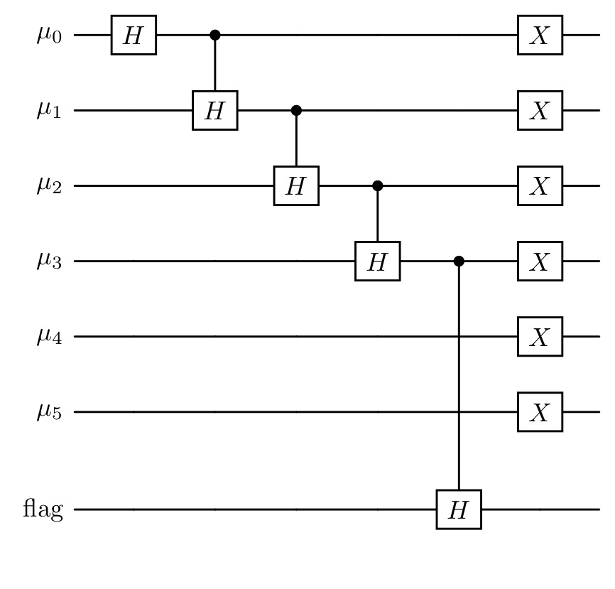{width="300" fig-align="center"}

Applying the controlled Hadamard gates step by step produces the following intermediate states (assuming $n_p \ge 2$):

$$
\begin{aligned}
&C(n_p - 2)H(\text{flag}) \cdot \left(\prod_{\mu =1}^{n_p - 2} C(\mu - 1)H(\mu)\right) \cdot H(0)\ket{00\dots 0}_\mu \ket{0}_{\text{flag}} \\
&= C(n_p - 2)H(\text{flag}) \cdot \left( \prod_{\mu = 1}^{n_p - 2} C(\mu - 1)H(\mu) \right)
\left(
\frac{1}{\sqrt{2}}\ket{000\dots 0}_\mu \ket{0}_{\text{flag}}
+ \frac{1}{\sqrt{2}}\ket{10\dots 0}_\mu \ket{0}_{\text{flag}}
\right) \\
&= C(n_p - 2)H(\text{flag}) \cdot \left( \prod_{\mu = 2}^{n_p - 2} C(\mu - 1)H(\mu) \right)
\left(
\frac{1}{\sqrt{2}}\ket{000\dots 0}_\mu \ket{0}_{\text{flag}}
+ \frac{1}{2}\ket{10\dots 0}_\mu \ket{0}_{\text{flag}}
+ \frac{1}{2}\ket{110\dots 0}_\mu \ket{0}_{\text{flag}}
\right) \\
&= C(n_p - 2)H(\text{flag}) \cdot
\left(
\sum_{\mu = 0}^{n_p - 2} \frac{1}{\sqrt{2}^{\,\mu + 1}}
\ket{\underbrace{1\dots 1}_{\mu} 0\dots 0}\ket{0}_{\text{flag}}
+ \frac{1}{\sqrt{2}^{(n_p - 2)+1}}
\ket{\underbrace{1\dots 1}_{n_p - 1}00}\ket{0}_{\text{flag}}
\right) \\
&= \sum_{\mu = 0}^{n_p - 1} \frac{1}{\sqrt{2}^{\,\mu + 1}}
\ket{\underbrace{1\dots 1}_{\mu} 0\dots 0}\ket{0}_{\text{flag}}
+ \frac{1}{\sqrt{2}^{(n_p - 2)+1}}
\ket{\underbrace{1\dots 1}_{n_p - 2}00}\ket{1}_{\text{flag}} .
\end{aligned}
$$

If we now flip all bits of $\mu$ we receive the state

$$
\begin{gathered}
\sum_{\mu = 0}^{n_p - 1} \frac{1}{\sqrt{2}^{\mu + 1}} \ket{0 \dots 0 \underbrace{1 \dots 1}_{\substack{n_p + 1 - \mu}} } \ket{0}_{\text{flag}} + \frac{1}{\sqrt{2}^{(n_p - 2) + 1}} \ket{0 \dots 0 11} \ket{1}_{\text{flag}} \\
= \sum_{\mu = 2}^{n_p + 1} \frac{1}{\sqrt{2}^{n_p + 1 - \mu + 1}} \ket{0 \dots 0 \underbrace{1 \dots 1}_{\substack{\mu}} } \ket{0}_{\text{flag}} + \frac{1}{\sqrt{2}^{(n_p - 2) + 1}} \ket{0 \dots 0 11} \ket{1}_{\text{flag}} \\
= \frac{1}{\sqrt{2^{n_p + 2}}} \sum_{\mu = 2}^{n_p + 1} \sqrt{2^\mu} \ket{0 \dots 0 \underbrace{1 \dots 1}_{\substack{\mu}} } \ket{0}_{\text{flag}} + \frac{1}{\sqrt{2}^{(n_p - 2) + 1}} \ket{0 \dots 0 11} \ket{1}_{\text{flag}}
\end{gathered}
$$

where the flag signals success when 0. This is exactly the state we wanted to reach in our first step. In the case where $n_p = 1$, we can simply use a Hadamard on the flag qubit to achieve the desired state.

<details>

<summary>Code</summary>

```{python}
def prep_mu(
        n_p: int,
        mu: Sequence[int], # length should be n_p + 1
        flag: int
) -> tq.QCircuit:
    assert len(mu) == n_p + 1
    U = tq.QCircuit()
    if n_p == 1:
        U += tq.gates.H(flag)
    else:
        U += tq.gates.H(target = mu[0])
        for i in range(n_p - 2):
            U += tq.gates.H(target = mu[i + 1], control = mu[i])
        U += tq.gates.H(target = flag, control = mu[n_p - 2])
    for i in range(n_p + 1):
        U += tq.gates.X(target = mu[i])
    return U
```

</details>

<details>

<summary>Test</summary>

```{python}
def print_Toffoli_cost(U: tq.QCircuit | PostselectionCircuit):
    Toffoli_cost = 0
    circuits = (
        [circuit for circuit in U._fragments if isinstance(circuit, tq.QCircuit)]
        if isinstance(U, PostselectionCircuit)
        else [U]
    )
    for circuit in circuits:
        Toffoli_cost += sum(1 for g in circuit.gates if g._name == "H" and len(g.control) == 1)
        Toffoli_cost += sum(1 for g in circuit.gates if g._name == "X" and len(g.control) == 2)
        Toffoli_cost += sum((len(g.control) - 1) for g in circuit.gates if g._name == "X" and len(g.control) > 2)
    print(f"{Toffoli_cost} Total Toffoli cost")

def test_prep_mu(n_p):
    mu = range(n_p + 1)
    flag = n_p + 1
    U = prep_mu(n_p, mu, flag)

    PS = PostselectionCircuit(U)
    PS += Postselection([flag])

    wfn, norm = PS.simulate()
    vec = wfn.to_array(out_numbering=BitNumbering.LSB)
    vec = norm * vec
    expected = np.zeros_like(vec)
    idx = 2**n_p
    for i in list(reversed(range(2,n_p + 2))):
        idx += 2**(i-2)
        mu_val = n_p + 3 - i
        amp = 1/np.sqrt(2**(n_p+2))*np.sqrt(2**mu_val)
        expected[idx] = amp
    np.testing.assert_allclose(vec, expected, atol=1e-10)
    print_Toffoli_cost(U)
    expected_toffoli = n_p - 1
    print(f"{expected_toffoli} Expected Toffoli cost")
    print()

test_prep_mu(1)
test_prep_mu(2)
test_prep_mu(3)
test_prep_mu(4)
test_prep_mu(5)
test_prep_mu(6)
test_prep_mu(7)
```

</details>

The next step is to prepare the state

$$
\frac{1}{\sqrt{2^{n_p + 2}}} \sum_{\mu = 2}^{n_p + 1} \sum_{\nu_x, \nu_y , \nu_z = -(2^{\mu - 1} - 1)}^{2^{\mu - 1} - 1} \frac{1}{2^\mu} \ket{\mu} \ket{\nu_x} \ket{\nu_y} \ket{\nu_z}.
$$

where $\mu$ is represented in unary as before and the $\nu$ are represented as $\ket{\nu_{x, sign} 0 \dots 0 \nu_{x, \mu - 2} \dots \nu_{x,0}}$, equivalently for $\nu_y$ and $\nu_z$. To prepare this state we will use six Hadamards and $3(n_p - 1)$ controlled Hadamards. We use the Hadamards on the sign bit and the zero bit of each $\nu$, since these need to be in uniform superposition for every $\mu$. We then use Hadamards on each $\nu_j$ controlled by the $(j + 1)$ th qubit in $\ket{\mu}$ from the right. For each value of $\mu$, exactly $3\mu$ controlled Hadamards act on the $\nu$ registers. This produces the new amplitude factor $\sqrt{2^\mu} \cdot 1/{\sqrt{2^{3\mu}}} = 1/2^\mu$. At this point, we still have two representations of the zero value, because zero with negative sign is also possible.

We eliminate the negative zero representation by flagging it as failure. This is done by checking for each $\nu$ whether the sign bit is 1 and all other bits are 0. This requires three multi-controlled Toffoli gates with $n_p + 1$ controls each. Then another 2 Toffolis to combine the results.

In our implementation we give the option to directly uncompute the used ancilla afterwards so that they can be reused for the next operation. This reduces the qubit cost but increases the Toffoli cost. In the reference the ancilla are not uncomputed, since minimizing gate cost is generally more important than minimizing qubit count. Also note that for the block encoding, we will need to use the inverted circuit again, which increases the Toffoli count further. For classical simulation, however, minimizing the qubit count is essential.

<details>

<summary>Code</summary>

```{python}
def init_nu(
        n_p: int,
        mu: Sequence[int],          # mu and nu require length n_p + 1
        nu_x: Sequence[int],
        nu_y: Sequence[int],
        nu_z: Sequence[int],
        ancilla: Sequence[int],    # requires 4 ancilla
        flag: int,
        uncompute: bool = True
) -> tq.QCircuit:
    
    U = tq.QCircuit()

    U += tq.gates.H(target = [nu_x[0], nu_x[-1], nu_y[0], nu_y[-1], nu_z[0], nu_z[-1]])

    for i in range(n_p - 1):
        for reg in [nu_x, nu_y, nu_z]:
            U += tq.gates.H(target = reg[n_p - i - 1], control = mu[n_p - i - 2])

    # flag -0 as failure:

    # flip all nu qubits except for the sign:
    for reg in [nu_x, nu_y, nu_z]:
        U += tq.gates.X(target = list(reg[1:]))

    # define as extra circuit for uncomputation:
    flagging = tq.QCircuit()

    # set ancilla[0..2] to 1, if invalid, for X, Y, Z:
    flagging += tq.gates.X(target = ancilla[0], control = list(nu_x))
    flagging += tq.gates.X(target = ancilla[1], control = list(nu_y))
    flagging += tq.gates.X(target = ancilla[2], control = list(nu_z))

    # flip ancilla[0..2], as they are valid iff all are 0:
    flagging += tq.gates.X(target=list(ancilla[0:3]))

    # combine ancilla to flag:
    flagging += tq.gates.Toffoli(first = ancilla[0], second= ancilla[1], target=ancilla[3])
    U += flagging
    U += tq.gates.Toffoli(first = ancilla[2], second= ancilla[3], target=flag)

    if uncompute:
        U += flagging.dagger()

    # now flag == 0 if invalid -> flip so it is zero when valid:
    U += tq.gates.X(flag)

    # flip nu qubits back:
    U += tq.gates.X(target = list(nu_x[1:]))
    U += tq.gates.X(target = list(nu_y[1:]))
    U += tq.gates.X(target = list(nu_z[1:]))

    return U
```

</details>

<details>

<summary>Test</summary>

```{python}
# testing code for init_nu
def decode_bits_init_nu(idx: int, n_p: int) -> list[int]:
    mu_width = n_p + 1
    mu_bits = idx & ((1 << mu_width) - 1)
    mu = mu_bits.bit_count()

    def decode_nu_at(offset):
        block = (idx >> offset) & ((1 << (n_p + 1)) - 1)

        # get printed bits b3 b2 b1 b0
        # b0 = sign (ignored)
        # b3 = LSB of magnitude
        nu_val = 0
        for i in range(n_p):
            # printed MSB is bit (n_p - i)
            b = (block >> (n_p - i)) & 1
            nu_val |= b << i  # b3 -> 2^0, b2 -> 2^1, b1 -> 2^2

        return nu_val

    nu_x = decode_nu_at(mu_width)
    nu_y = decode_nu_at(mu_width + (n_p + 1))
    nu_z = decode_nu_at(mu_width + 2 * (n_p + 1))

    return [mu, nu_x, nu_y, nu_z]

def test_init_nu(n_p: int):
    mu = range(n_p + 1)
    nu_x = range(n_p + 1, 2*(n_p + 1))
    nu_y = range(2*(n_p + 1), 3*(n_p + 1))
    nu_z = range(3*(n_p + 1), 4*(n_p + 1))
    ancilla = range(4*(n_p + 1), 4*(n_p + 1) + 4)

    flag_mu = 4*(n_p + 1) + 4
    flag_nu = 4*(n_p + 1) + 5

    n = 4*(n_p + 1) + 6

    U = prep_mu(n_p, mu, flag_mu)
    U += init_nu(n_p, mu, nu_x, nu_y, nu_z, ancilla, flag_nu)

    PS = PostselectionCircuit(U)
    PS += Postselection([flag_mu])
    PS += Postselection([flag_nu])

    wfn, norm = PS.simulate()

    vec = wfn.to_array(out_numbering=BitNumbering.LSB)
    vec = norm * vec

    nonzero_indices = np.nonzero(vec)[0]

    count = 0
    for mu_val in range(2, n_p + 2):
        count += (2*(2**(mu_val-1)) - 1)**3

    assert len(nonzero_indices) == count

    for idx in nonzero_indices:
        decoded = decode_bits_init_nu(idx, n_p)
        mu_val = decoded[0]

        expected = 1/(np.sqrt(2**(n_p + 2))*(2**mu_val))
        np.testing.assert_allclose(vec[idx], expected, atol=1e-10)

        for nu in decoded[1:]:
            assert nu <= 2**(mu_val - 1) - 1


test_init_nu(1)
test_init_nu(2)
test_init_nu(3)
test_init_nu(4)
```

</details>

Now we want to reduce the $\nu$ values to the set of $B_\mu$, which is the set of $\nu$ such that all $|\nu_x|$, $|\nu_y|$, $|\nu_z|$ are less than $2^{\mu - 1}$, excluding the case that they are all less than $2^{\mu - 2}$. Since the first condition is already satisfied, we only need to remove those $\nu$ for which all components are smaller than $2^{\mu - 2}$. For this we first convert the $\mu$ register to one-hot unary, meaning that for every $\mu$ only the most significant bit that is one stays one and the rest is changed to zero. This can be done by simply using CNOTs from MSB to (LSB - 1), where the bit controls an X gate on all lower bits. We then check for each $\nu$, whether the $(\mu - 1)$th qubit is 0 and flag failure otherwise. This requires Toffoli gates with four controls and needs to be done for each bit of $\nu$ except for the sign, so $n_p$ times. The state we reach then looks like:

$$
\frac{1}{\sqrt{2^{n_p + 2}}} \sum_{\mu = 2}^{n_p + 1} \sum_{\nu \in B_\mu} \frac{1}{2^\mu} \ket{\mu} \ket{\nu_x} \ket{\nu_y} \ket{\nu_z}
$$

<details>

<summary>Code</summary>

```{python}
def filter_nu(
        n_p: int,
        mu: Sequence[int],
        nu_x: Sequence[int],
        nu_y: Sequence[int],
        nu_z: Sequence[int],
        flag: int
) -> tq.QCircuit:
    
    U = tq.QCircuit()

    if n_p == 1: # special case
        U += tq.gates.X(mu[1])
        for reg in [nu_x, nu_y, nu_z]:
            U += tq.gates.X(reg[1])
        U += tq.gates.X(control=[nu_x[1], nu_y[1], nu_z[1]], target=flag)
        for reg in [nu_x, nu_y, nu_z]:
            U += tq.gates.X(reg[1])
        return U
    
    # convert mu to one-hot unary:
    for i in range(n_p):
        U += tq.gates.X(control= mu[i], target= list(mu[i + 1:]))
    
    #filter out nu where all x, y and z smaller in absolute value than 2^(mu - 2):
    for i in range(n_p):
        for reg in [nu_x, nu_y, nu_z]:
            U += tq.gates.X(target = reg[i + 1])

        U += tq.gates.X(control= [mu[i], nu_x[i + 1], nu_y[i + 1], nu_z[i + 1]], target= flag)

        for reg in [nu_x, nu_y, nu_z]:
            U += tq.gates.X(target = reg[i + 1])
    
    return U
```

</details>

<details>

<summary>Test</summary>

```{python}
def decode_bits_filter_nu(idx: int, n_p: int) -> list[int]:
    mu_width = n_p + 1

    # Extract μ field (bits 1–n_p + 1)
    mu_field = int(idx) & ((1 << (n_p + 1)) - 1)
    # Decode μ in one-hot unary
    # find position of the highest set bit (standard bit_length)
    highest_bit = mu_field.bit_length()  # 1-based position from LSB
    # reverse: highest_bit 1 → μ = n_p+1, highest_bit 2 → μ = n_p, ...
    mu = n_p + 2 - highest_bit

    def decode_nu_at(offset):
        block = (idx >> offset) & ((1 << (n_p + 1)) - 1)

        # get printed bits b3 b2 b1 b0
        # b0 = sign (ignored)
        # b3 = LSB of magnitude
        nu_val = 0
        for i in range(n_p):
            # printed MSB is bit (n_p - i)
            b = (block >> (n_p - i)) & 1
            nu_val |= b << i  # b3 -> 2^0, b2 -> 2^1, b1 -> 2^2

        return nu_val

    nu_x = decode_nu_at(mu_width)
    nu_y = decode_nu_at(mu_width + (n_p + 1))
    nu_z = decode_nu_at(mu_width + 2 * (n_p + 1))

    return [mu, nu_x, nu_y, nu_z]

def test_filter_nu(n_p):

    mu = range(n_p + 1)

    nu_x = range(n_p + 1, 2*(n_p + 1))
    nu_y = range(2*(n_p + 1), 3*(n_p + 1))
    nu_z = range(3*(n_p + 1), 4*(n_p + 1))

    ancilla = range(4*(n_p + 1), 4*(n_p + 1) + 4)

    flag_mu = 4*(n_p + 1) + 4
    flag_nu = 4*(n_p + 1) + 5
    f_box   = 4*(n_p + 1) + 6

    n = 4*(n_p + 1) + 7

    U = prep_mu(n_p, mu, flag_mu)
    U += init_nu(n_p, mu, nu_x, nu_y, nu_z, ancilla, flag_nu)
    U += filter_nu(n_p, mu, nu_x, nu_y, nu_z, f_box)

    PS = PostselectionCircuit(U)
    PS += Postselection([flag_mu])
    PS += Postselection([flag_nu])
    PS += Postselection([f_box])

    wfn, norm = PS.simulate()

    vec = wfn.to_array(out_numbering=BitNumbering.LSB)
    vec = norm * vec

    nonzero_indices = np.nonzero(vec)[0]

    # expected number of states
    count = 0
    for mu_val in range(2, n_p + 2):
        count += (2*(2**(mu_val-1))-1)**3 - (2*(2**(mu_val-2))-1)**3
    assert len(nonzero_indices) == count

    for idx in nonzero_indices:

        decoded = decode_bits_filter_nu(idx, n_p)
        mu_val = decoded[0]

        expected = 1/(np.sqrt(2**(n_p + 2))*(2**mu_val))
        np.testing.assert_allclose(vec[idx], expected, atol=1e-10)

        for nu in decoded[1:]:
            assert nu < 2**(mu_val - 1)
            if nu > 2**(mu_val - 1) - 1:
                print(f"|{idx:0{n}b}>: {vec[idx]}")
                print(nu)
                print(mu_val)
                print(idx)

        assert (
            decoded[1] >= 2**(mu_val - 2)
            or decoded[2] >= 2**(mu_val - 2)
            or decoded[3] >= 2**(mu_val - 2)
        )


test_filter_nu(1)
test_filter_nu(2)
test_filter_nu(3)
test_filter_nu(4)
```

</details>

Now we introduce a new register $\ket{m}$ that needs to be initialized in equal superposition from $m = 0$ to $M - 1$ where M is a power of two. As discussed above, the accuracy of the block encoding improves with increasing $M$. It should thus be chosen sufficiently large. The superposition can be achieved by using a Hadamard on each bit of the register. This leads to the state

$$
\frac{1}{\sqrt{M2^{n_p + 2}}} \sum_{\mu = 2}^{n_p + 1} \sum_{\nu \in B_\mu} \sum_{m = 0}^{M - 1} \frac{1}{2^\mu} \ket{\mu} \ket{\nu_x} \ket{\nu_y} \ket{\nu_z} \ket{m}
$$

To achieve our final state we now need to change the sum over $m$ from $\sum_{m=0}^{M - 1}$ to $\sum_{m=0}^{\lceil M (2^{\mu - 2} / \|\nu\|)^2 \rceil - 1}$. This requires flagging every $m$ as failure that is larger than the upper bound $\lceil M (2^{\mu - 2} / \|\nu\|)^2 \rceil - 1$. For the states we want to keep we have

$$
\begin{aligned}
m & \le \left\lceil M \left(\frac{2^{\mu - 2}}{\|\nu\|}\right)^2 \right\rceil - 1 \\
\Leftrightarrow m + 1 & \le \left\lceil M \left(\frac{2^{\mu - 2}}{\|\nu\|}\right)^2 \right\rceil \\
\Leftrightarrow m & < M \left(\frac{2^{\mu - 2}}{\|\nu\|}\right)^2 \\
\Leftrightarrow m \cdot \|\nu\|^2 = m\left(\nu_x^2 + \nu_y^2 + \nu_z^2\right) & < M\left(2^{\mu - 2}\right)^2
\end{aligned}
$$

We use this equivalence and flag every state as failure where the final inequality

$$
m(\nu_x^2 + \nu_y^2 + \nu_z^2) < (2^{\mu - 2})^2M
$$

does not hold. To check this inequality, we compute $m(\nu_x^2 + \nu_y^2 + \nu_z^2)$ in a new ancilla register and use a relabeling of qubits to compute $(2^{\mu - 2})^2M$. Then these values are compared with a classic comparator. We will now look at all the single steps involved in the comparison in detail.

### Binary Squaring

We will first take a look at how to efficiently square a binary number in order to compute $(\nu_x^2 + \nu_y^2 + \nu_z^2)$. We will explain possible simplifications by using the squaring of a four-bit binary number as an example. A more formal derivation can be found in [@Su_2021] in Appendix G. The classic long multiplication of a four bit number can be displayed like this:

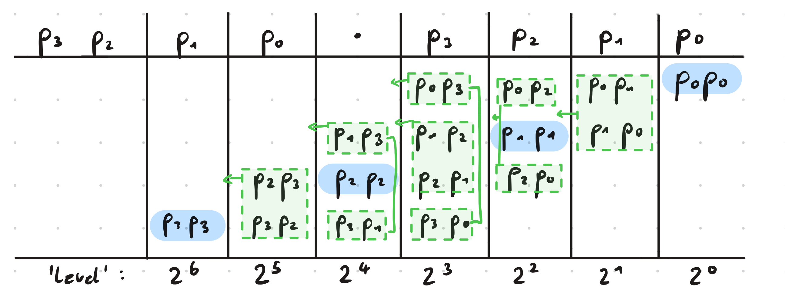{width="450" fig-align="center"}

There are on each level ($2^0$, $2^1$ and so on) pairs of bits that are multiplied with each other, and then all pairs on one level need to be added up and ultimately the results of the additions on each level need to be added together. Multiplying two bits requires one Toffoli, since it needs to be checked, whether both are one. This is however not necessary when both bits are the same, as marked in blue in the image. In that case, the value of the bit is also the value of its square, which means that no Toffoli is required for those bits. Another observation is that, on each level, each pair of distinct bits appears twice in the multiplication. It is therefore unnecessary to compute these products twice, instead, one can just use the result once and directly move it up one level, which is equivalent to a multiplication with two. With these two realizations, the bits needed to be summed on each level above can be reduced to:

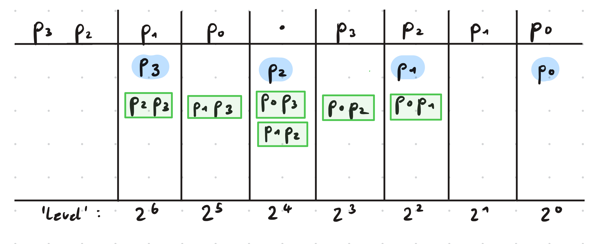{width="450" fig-align="center"}

Using these simplifications, Su et al. show that the square of a general binary number $p$ can be expressed like

$$
    p^2 = p_0 + \Sigma_1 + \Sigma_2 + \Sigma_3 + \Sigma_4
$$

where

\begin{aligned}
\Sigma_1 & = \sum_{l = 1}^{\lceil n/2 \rceil - 1} 2^{2l} \left( p_l + \sum_{j = 0}^{l - 1}p_{2l-1-j}p_j \right) \\

\Sigma_2 & = \sum_{l = 1}^{\lceil n/2 \rceil - 1} 2^{2l + 1} \left(\sum_{j = 0}^{l - 1}p_{2l - j}p_j\right) \\

\Sigma_3 & = \sum_{l = \lceil n/2 \rceil}^{n - 1} 2^{2l} \left(p_l + \sum_{j = 2l - n}^{l - 1}p_{2l-1-j}p_j\right) \\

\Sigma_2 & = \sum_{l = \lceil n/2 \rceil}^{n - 2} 2^{2l + 1} \left(\sum_{j = 2l -n+1}^{l - 1}p_{2l - j}p_j\right). \\
\end{aligned}

Here, $p_0$ is the LSB and $n$ the number of bits. $\Sigma_1$ and $\Sigma_3$ correspond to the even levels, while the others correspond to the odd levels. As we can see in the example above, on level $2^0$, we have only one qubit and on level $2^1$ there is no qubit. This is always the case, not only for $n = 4$. Starting from level $2^2$ we will have to add up multiple bits on each level.

Starting from the lowest relevant level, we will always compute the product of the corresponding pairs and then add up all summands, such that we have a one bit result for that level and multiple one bit carries, that will be summed together with the bits of the next level. When there are $l$ bits to sum on a level, we will pass $\lceil l/2 \rceil$ carry bits to the next level. We will compute the result for each level iteratively, starting by the lowest level, so that the carry bits from the level before can always be integrated directly.

Now we will take a closer look at how to add up $l$ bits on a specific level. Three bits of the same level can be summed up using one Toffoli and CNOTs as shown in @Gidney_2018:

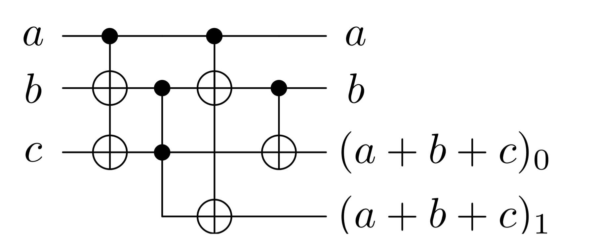{width="250" fig-align="center"}

This will leave the bits a and b untouched and change c to the result for the same level, while the last bit is a carry for the next level.

<details>

<summary>Code</summary>

```{python}
# three bit adder, a and b stay the same, c -> (a + b + c)_0, carry -> (a + b + c)_1
def sum_triple(
        a: int,
        b: int,
        c: int,
        carry: int
) -> tq.QCircuit:
    U = tq.QCircuit()
    U += tq.gates.X(target=[b, c], control=a)
    U += tq.gates.Toffoli(target=carry, first=b, second=c)
    U += tq.gates.X(target=[b, carry], control=a)
    U += tq.gates.CNOT(target=c, control=b)
    return U
```

</details>

If we now want to sum $l$ same-level bits together, we need one bit for the result on that level and $l/2$ carry bits. Then we will always take two of the input bits as a and b, the result bit as c and one of the carry bits as carry. It is possible to initialize the result bit as one of the input bits to reduce Toffoli cost. If a single bit is left, a two bit adder can be used, which also requires one Toffoli. In the end we will have combined each two bits to one carry bit and have the result for that level in the result bit. Then we can go on with the next level, adding up the defined summands for that level as well as the carries from before.

<details>

<summary>Code</summary>

```{python}
# n-bit adder: adds n bits on the same level, writes carries to n/2 individual ancilla
# If the carry bits need to be freed in the end, the circuit needs to reversed
# and afterwards the other bits need to be recomputed.
# The Uncompute gets appended by the uncomputation, that still needs to be daggered in the end.
def add_n_bits(
        in_bits: Sequence[int],
        level_result: int,
        carries: list[int],
        next_level: list[int],
        Uncompute: tq.QCircuit

) -> tq.QCircuit:
    # Actual circuit:
    U = tq.QCircuit()
    # Only for uncomputation:
    Recompute = tq.QCircuit()
    
    U += tq.gates.CNOT(in_bits[0], level_result)
    a = 1
    while len(in_bits) >= a + 2:
        carry = carries.pop()
        U += sum_triple(in_bits[a], in_bits[a + 1], level_result, carry)
        Recompute += tq.gates.X(control=in_bits[a], target=[in_bits[a+1], level_result])
        Recompute += tq.gates.CNOT(in_bits[a], in_bits[a + 1])
        Recompute += tq.gates.CNOT(in_bits[a + 1], level_result)
        a += 2
        next_level.append(carry)
    # if one bit left, use two bit adder:
    if len(in_bits) == a + 1:
        carry = carries.pop()
        U += tq.gates.Toffoli(first=in_bits[a], second=level_result, target=carry)
        U += tq.gates.CNOT(in_bits[a], level_result)
        Recompute += tq.gates.CNOT(in_bits[a], level_result)
        next_level.append(carry)
    Uncompute += tq.gates.CNOT(in_bits[0], level_result).dagger()
    Uncompute += Recompute.dagger()
    Uncompute += U
    return U
```

</details>

Now we get to the implementation of the actual squaring. After taking a closer look at the four sums defined above, it gets clear that $\Sigma_1$ defines the bits needed to be summed on level $2^2$, $\Sigma_2$ defines those for level $2^3$ and they take turns like this up until $2^{2\lceil n/2\rceil - 1}$. Additionally to the bits defined in those sums, the carry bits from the level before need to be added. Similarly it then goes on for $\Sigma_3$ and $\Sigma_4$. Also, note that in the end we want to compute $m(\nu_x^2 + \nu_y^2 + \nu_z^2)$. Instead of computing each square separately and then summing up the three results, it is more efficient to directly sum the squaring bits on each level for each $\nu$ together. This means that we will implement a circuit that directly computes $\nu_x^2 + \nu_y^2 + \nu_z^2$.

<details>

<summary>Code</summary>

```{python}
# Implements the sigmas used for the squaring circuit
def sigma(
        sigma: int,
        px: Sequence[int],
        py: Sequence[int],
        pz: Sequence[int],
        l: int,
        n: int,
        result: Sequence[int],
        free_ancilla: list[int],
        Uncompute: tq.QCircuit,
        next_level: list[int]
) -> tq.QCircuit:
    U = tq.QCircuit()
    in_bits = []
    if sigma in {1,3}:
        in_bits.extend([px[l], py[l], pz[l]])
    # append bits from previous sum
    in_bits.extend(next_level.copy())
    next_level.clear()
    U_mult = tq.QCircuit()
    if sigma in {1, 2}:
        iteration = range(l)
    elif sigma == 3:
        iteration = range(2*l - n, l)
    elif sigma == 4:
        iteration = range(2*l - n + 1, l)
    for j in iteration:
        if sigma in {1, 3}:
            i = 2*l - 1 - j
        else:
            i = 2*l - j

        for reg in [px, py, pz]:
            target = free_ancilla.pop()
            U_mult += tq.gates.Toffoli(first=reg[i], second=reg[j], target=target)
            in_bits.append(target)
    U += U_mult
    # Uncomputation is daggered in the end
    Uncompute += U_mult
    level = 2*l
    if sigma in {2, 4}:
        level += 1
    U += add_n_bits(in_bits=in_bits, level_result=result[level], carries=free_ancilla, next_level=next_level, Uncompute=Uncompute)
    return U

# returns px^2 + py^2 + pz^2
# LSB -> MSB
def triple_square(
        px: Sequence[int],
        py: Sequence[int],
        pz: Sequence[int],
        result: Sequence[int],
        ancilla: Sequence[int],
        uncompute = True
) -> tq.QCircuit:
    U = tq.QCircuit()

    assert(len(px) == len(py))
    assert(len(px) == len(pz))

    n = len(px)
    # store carry bits of current level sum:
    next_level = []
    free_ancilla = list(reversed(ancilla))
    # uncomputation of ancilla:
    Uncompute = tq.QCircuit()

    # sum level-0 bits:
    U += tq.gates.CNOT(control=px[0], target=result[0])
    U += sum_triple(py[0], pz[0], result[0], result[1])

    # Sigma 1 and Sigma 2
    for l in range(1, math.ceil(n / 2)):

        U += sigma(1, px, py, pz, l, n, result, free_ancilla, Uncompute, next_level)
        U += sigma(2, px, py, pz, l, n, result, free_ancilla, Uncompute, next_level)

    # Sigma 3 and Sigma 4
    for l in range(math.ceil(n/2), n):

        U += sigma(3, px, py, pz, l, n, result, free_ancilla, Uncompute, next_level)
        
        # Sigma 4
        if l <= n-2:
             U += sigma(4, px, py, pz, l, n, result, free_ancilla, Uncompute, next_level)

    level = 2*n-1

    while len(next_level) > 1:
        in_bits = next_level.copy()
        next_level = []
        U += add_n_bits(in_bits, result[level], free_ancilla, next_level, Uncompute=Uncompute)
        level += 1
    if len(next_level) == 1:
        U += tq.gates.X(control=next_level[0], target=result[level])
    if uncompute:
        U += Uncompute.dagger()
    
    return U
```

</details>

<details>

<summary>Test</summary>

```{python}
def test_triple_square(n, x, y, z):
    assert x <= 2**(n) - 1
    assert y <= 2**(n) - 1
    assert z <= 2**(n) - 1
    
    start = 0
    x_reg = range(start, start + n)
    start += n
    y_reg = range(start, start + n)
    start += n
    z_reg = range(start, start + n)
    start += n

    if n == 1:
        len_square_result = 2
    elif n == 2:
        len_square_result = 5
    else:
        len_square_result = 2*n + 2

    result_reg = range(start, start + len_square_result)
    start += len_square_result

    ancilla_len = 3 * n ** 2 - n - 1
    ancilla_len -= 1
    ancilla = range(start, start + ancilla_len)

    U = tq.QCircuit()

    x_bits = [(x >> i) & 1 for i in range(n)]
    for i in range(n):
        if x_bits[i] == 1:
            U += tq.gates.X(x_reg[i])
    y_bits = [(y >> i) & 1 for i in range(n)]
    for i in range(n):
        if y_bits[i] == 1:
            U += tq.gates.X(y_reg[i])
    z_bits = [(z >> i) & 1 for i in range(n)]
    for i in range(n):
        if z_bits[i] == 1:
            U += tq.gates.X(z_reg[i])

    U += triple_square(x_reg, y_reg, z_reg, result_reg, ancilla)

    result = tq.simulate(U)
    vec = result.to_array(BitNumbering.LSB)
    idx = int(np.argmax(vec))

    # extract result register
    result_bits = (idx >> (3*n)) & ((1 << len_square_result) - 1)

    assert result_bits == x**2 + y**2 + z**2

test_triple_square(1, 1, 0, 1)
test_triple_square(1, 0, 0, 1)
test_triple_square(1, 0, 1, 0)
test_triple_square(2, 0, 0, 1)
test_triple_square(2, 1, 2, 3)
#test_triple_square(3, 7, 0, 1) qubit count too high
```

</details>

### Binary Multiplication

We now multiply this result by $m$ to obtain $m(\nu_x^2 + \nu_y^2 + \nu_z^2)$. Multiplying two numbers $p$ and $q$, where $p$ is of length $n$ and $q$ of length $m$ with $n \ge m$ can be expressed as

$$
\sum_{j=0}^{n-1}\sum_{k=0}^{m-1}p_jq_k2^{j+k} = \sum_{l=0}^{m-1}\sum_{k=0}^{l}p_{l-k}q_{k}2^l + \sum_{l=m}^{n-1}\sum_{k=0}^{m-1}p_{l-k}q_k2^l + \sum_{l=n}^{n+m-2}\sum_{k=l-n+1}^{m-1}p_{l-k}q_{k}2^l.
$$

The different sums again group bits together that need to be summed on the same level. The implementation follows the same principles as the squaring circuit.

<details>

<summary>Code</summary>

```{python}
# Binary Product (Lemma 10, p.81), LSB -> MSB
def binary_product(
        a: Sequence[int],
        b: Sequence[int],
        result: Sequence[int],
        ancilla: Sequence[int],
        uncompute = True
) -> tq.QCircuit:
    U = tq.QCircuit()

    # algorithm requires |p| >= |q|
    if(len(a) >= len(b)):
        p = a
        q = b
    else:
        p = b
        q = a

    n = len(p)
    m = len(q)

    # store carry bits of current level sum:
    next_level = []
    free_ancilla = list(reversed(ancilla))
    # uncomputation of ancilla:
    Uncompute = tq.QCircuit()

    for l in range(m):
        in_bits = next_level.copy()
        next_level = []
        for k in range(l + 1):
            target = free_ancilla.pop()
            U += tq.gates.Toffoli(first=p[l-k], second=q[k], target=target)
            Uncompute += tq.gates.Toffoli(first=p[l-k], second=q[k], target=target)
            in_bits.append(target)
        U += add_n_bits(in_bits, result[l], free_ancilla, next_level, Uncompute)
        in_bits = []

    for l in range(m, n):
        in_bits = next_level.copy()
        next_level = []
        for k in range(m):
            target = free_ancilla.pop()
            U += tq.gates.Toffoli(first=p[l-k], second=q[k], target=target)
            Uncompute += tq.gates.Toffoli(first=p[l-k], second=q[k], target=target)
            in_bits.append(target)
        U += add_n_bits(in_bits, result[l], free_ancilla, next_level, Uncompute)
        in_bits = []

    for l in range(n, n + m - 1):
        in_bits = next_level.copy()
        next_level = []
        for k in range(l - n + 1, m):
            target = free_ancilla.pop()
            U += tq.gates.Toffoli(first=p[l-k], second=q[k], target=target)
            Uncompute += tq.gates.Toffoli(first=p[l-k], second=q[k], target=target)
            in_bits.append(target)
        U += add_n_bits(in_bits, result[l], free_ancilla, next_level, Uncompute)

    level = n + m - 1

    while len(next_level) > 1:
        in_bits = next_level.copy()
        next_level = []
        U += add_n_bits(in_bits, result[level], free_ancilla, next_level, Uncompute=Uncompute)
        level += 1
    if len(next_level) == 1:
        U += tq.gates.X(control=next_level[0], target=result[level])
    if uncompute:
        U += Uncompute.dagger()

    return U
```

</details>

Now we need to compute $(2^{\mu-2})^2M$. Remember that $\mu$ is in unary representation. We can add zeros in between each two qubits to get a unary representation of $2\mu$: For example $\mu = 1$ would be changed from $0001$ to $0\underline{0}0\underline{0}0\underline{0}1\underline{0}$ where the underlined zeros are those that have been newly inserted. This will always work since the number of zeros behind the one is always doubled when larger than zero. Now we have a bitstring where only the $(\mu+2)$th bit from the right is one. In binary representation, this represents the value $2^{2\mu - 1}$ and we have $2^{2\mu - 1} \cdot 2^{-3}M = 2^{\mu - 4}M = 2^{(\mu-2)^2}M$. Since $M$ is a classically chosen value and a power of two, we have $2^{-3}M = 2^{-3}\cdot 2^{\log M} = 2^{\log M - 3}$, where $\log M$ is a natural number. To multiply a binary number by a power of two, one can simply pad it with zeros from the LSB corresponding to the number of the exponent. Thus, $(2^{\mu-2})^2M$ can be reached by padding $2^{2\mu - 1}$ with $(\log_2 M) - 3$ bits [^1]. This means that in total we only need to insert zeros to achieve the aspired number. It is not necessary to actually insert those qubits, instead the comparison circuit, which will be introduced next, can simply be adjusted to work with the original $\mu$ and still output the comparison result for $(2^{\mu-2})^2M$.

[^1]: In the paper they suggest to pad with $log_2M - 5$ zeros, this does however not seem to add up, which is why we changed this to $log_2M - 3$ here.

### Binary Comparison[^2]

[^2]: This part is partially adopted from a seminar paper I wrote before on a related topic.

The comparison of two bitstrings a and b can be realized by calculating $a - b$ and checking whether the result is negative or not. Binary subtraction is usually performed by adding the two's complement of the subtrahend to the minuend. Then, if and only if the most significant bit of the result is 1, it is negative, which means that $b > a$.

For example, let $a=101_2=5$ and $b=100_2=4$. We first extend these to four bits, so $a=0101$ and $b=0100$. Next, we flip all bits of $b$ to get $1011$ and add $1$, resulting in $-b = 1100_2 = -8 + 4 = -4$. In two's complement, the MSB is interpreted with a negative sign. Now, when we add $a$ and $-b$, we get $a + (-b) = 0001_2 = 1_{10}$. Since the MSB of the result is 0, we conclude that $a \geq b$. Note that the carry-out from the MSB does not represent an overflow when adding two numbers in two's complement. Specifically, when adding a positive number to a negative number, the sum cannot overflow, and the carry-out can be safely ignored.

In conclusion, the comparison of two binary strings can be implemented using binary addition. @Gidney_2018 propose a quantum adder that requires the use of $2n - 2$ Toffoli gates, which can be constructed using only $4n + O(1)$ T gates. The circuit for four bits would look like:

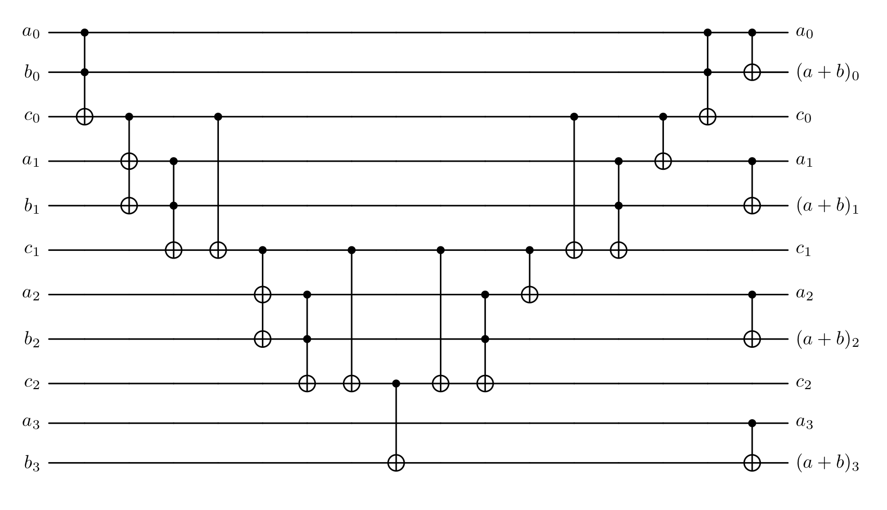{width="450" fig-align="center"}

This adder has the qubit strings $a = a_0 \dots a_{n-1}$ and $b = b_0 \dots b_{n-1}$ as input, as well as $n - 1$ carry-bits, which are initialized as 0. $a_0$ and $b_0$ are the least significant bits and $a_{n-1}$ and $b_{n-1}$ the most significant bits of $a$ and $b$. First, the carry-bits are evaluated, and then in the end, the actual addition is done, where the result overwrites the $b$ lines.

To use this circuit for comparison rather than addition, several modifications are required. As mentioned earlier, instead of using $b$ directly, we use its two's complement. This requires flipping each qubit of $b$ and adding 1 to it. Consequently, both $a$ and $b$ must be extended by an additional bit. In practice, this means using an (n+1)-bit adder. However, since the newly added MSB of $a$ is always zero, it can be ignored. For $b_n$, we can simply use the flag where we want the result of the operation to be anyway.

The flipping of $b$ is straightforward using X-gates, but adding the extra 1 typically requires an additional carry-in. Fortunately, we don’t actually need the full result of the addition — only the correct carry bit, ensuring that the most significant bit is computed correctly.

The initial carry $c_0$ is always 1, except when both $a_0$ and $\overline{b}_0$ are 0. To handle this, we initialize the carry-bit $c_0$ as 1 and only flip it if $a_0 = 0$ and $b_0 = 1$. Although the correct two's complement of $b$ would require initializing flag ($b_n$) as 1, we don’t need to do so because we ultimately require the flipped result.

Finally, since the qubits in $b$ must remain unchanged, we must revert all operations after computing flag. This means undoing intermediate steps and omitting the final CNOTs. Once these modifications are applied, the updated circuit looks as follows for three bit inputs:

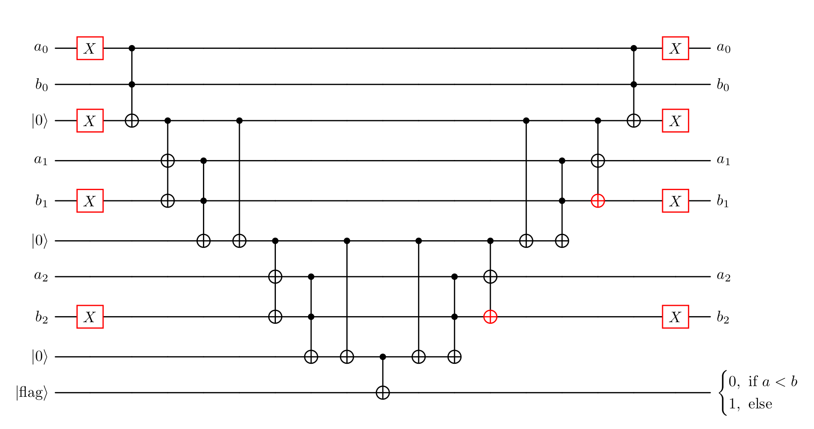{width="450" fig-align="center"}

<details>

<summary>Code</summary>

```{python}
# comparator of 2 n-bit numbers, LSB -> MSB, flag == 0 iff a < b, requires n additional ancilla
def comparator(
        a: Sequence[int],
        b: Sequence[int],
        flag: int,
        ancilla: Sequence[int]
) -> tq.QCircuit:
    U = tq.QCircuit()
    n = len(a)

    U += tq.gates.X(target=[a[0],ancilla[0]])
    U += tq.gates.X(target=list(b[1:]))

    U += tq.gates.Toffoli(a[0], b[0], ancilla[0])

    for i in range(1, n):
        U += tq.gates.X(control=ancilla[i - 1], target=[a[i], b[i]])
        U += tq.gates.Toffoli(a[i], b[i], ancilla[i])
        U += tq.gates.CNOT(control=ancilla[i - 1], target=ancilla[i])

    Uncompute = U.dagger()

    U += tq.gates.CNOT(ancilla[n - 1], flag)
    U += Uncompute
    
    return U
```

</details>

For our specific use case however, we require further adaptations. Our input for $a$ will be $\nu_x^2 + \nu_y^2 + \nu_z^2$ and $b$ will be $(2^{\mu-2})^2M$. Unlike $a$ and $b$ as in the circuit above, these two inputs are not necessarily of the same length, which requires adaptation. Also we want to only give $\mu$ as input but receive the result for $b$ being $(2^{\mu-2})^2M$. Both necessary adaptations only require inserting additional zeros within $a$ or $b$. We need to insert $\log M - 3$ zeros as the first bits of $b$. This results in the comparing being redundant until that part, since we always have $a \ge b$ for that first part. The circuit only needs to start at the first bit, where $b$ is not an inserted zero. From that part on, we will need ancilla and Toffoli gates for every comparison, where a is still defined, but the circuit is slightly adjusted for the inserted zeros. In the case that $a$ is shorter than $b$, we will fill it with zeros, which again slightly adjusts the circuit, and in the cases, where both bits $a$ and $b$ are known to be zero, we can again skip that part.

<details>

<summary>Code</summary>

```{python}
# comparator of 2 numbers, LSB -> MSB, sets flag to 0 iff a < (2^(mu - 1))^2*M
# mu in_put is assumed to be one-hot unary
# requires max(len(a) - log2(M) - 1, 2*len(mu) - 1) ancilla
# uses (2^(mu - 1))^2*M instead of mu, M needs to be power of 2 and >= 8
# works for arbitrary lengths of a and mu
def comparator_M(
        a: Sequence[int],
        mu: Sequence[int],
        flag: int,
        ancilla: Sequence[int],
        M: int,
        uncompute = True
) -> tq.QCircuit:
    U = tq.QCircuit()

    padding = math.ceil(math.log2(M) - 3)

    if len(a) > padding + 1:
        U += tq.gates.X(a[padding + 1])
        U += tq.gates.Toffoli(a[padding + 1], mu[0], ancilla[0])
        U += tq.gates.X(ancilla[0])
    else:
        U += tq.gates.CNOT(mu[0], ancilla[0])
        U += tq.gates.X(ancilla[0])        

    # store 'current' ancilla index:
    ancilla_i = 1

    for i in range(padding + 2, padding + 2*len(mu), 2):

        # mu is 0:
        if len(a) > i:
            U += tq.gates.CNOT(ancilla[ancilla_i - 1], a[i])
            U += tq.gates.X(ancilla[ancilla_i - 1])
            U += tq.gates.Toffoli(ancilla[ancilla_i - 1], a[i], ancilla[ancilla_i])
            U += tq.gates.X(ancilla[ancilla_i - 1])
            U += tq.gates.CNOT(ancilla[ancilla_i - 1], ancilla[ancilla_i])
            ancilla_i += 1
        
        # mu with value:
        current_mu = mu[(math.ceil((i - padding) / 2))]
        if len(a) > i + 1:
            U += tq.gates.X(current_mu)
            U += tq.gates.X(control=ancilla[ancilla_i - 1], target=(a[i + 1], current_mu))
            U += tq.gates.Toffoli(a[i + 1], current_mu, ancilla[ancilla_i])
            U += tq.gates.CNOT(ancilla[ancilla_i - 1], ancilla[ancilla_i])
            ancilla_i += 1
        else: # a is 0
            U += tq.gates.X(current_mu)
            U += tq.gates.CNOT(ancilla[ancilla_i - 1], current_mu)
            U += tq.gates.Toffoli(ancilla[ancilla_i - 1], current_mu, ancilla[ancilla_i])
            U+= tq.gates.CNOT(ancilla[ancilla_i - 1], ancilla[ancilla_i])
            ancilla_i += 1

    # mu is 0
    for i in range(padding + 2*len(mu), len(a)):
        U += tq.gates.CNOT(ancilla[ancilla_i - 1], a[i])
        U += tq.gates.X(ancilla[ancilla_i - 1])
        U += tq.gates.Toffoli(ancilla[ancilla_i - 1], a[i], ancilla[ancilla_i])
        U += tq.gates.X(ancilla[ancilla_i - 1])
        U += tq.gates.CNOT(ancilla[ancilla_i - 1], ancilla[ancilla_i])
        ancilla_i += 1

    Uncompute = U.dagger()

    U += tq.gates.CNOT(ancilla[ancilla_i - 1], flag)
    if uncompute:
        U += Uncompute
    
    return U
```

</details>

<details>

<summary>Test</summary>

```{python}
# Testing Code for comparator_M
def index_to_bits_msb_to_lsb(idx, n_qubits):
    """
    Returns bits in physical qubit order [q0, q1, ..., q_{n-1}]
    assuming idx is MSB -> LSB encoded.
    """
    return [ (idx >> (n_qubits - 1 - i)) & 1 for i in range(n_qubits) ]

def test_comparator(
        a_int: int, # a_int <= 2^(a_len) - 1
        a_len: int,
        mu_int: int,
        mu_len: int, # mu will be encoded in one-hot unary, so mu_len >= mu_int
        M: int):
    
    assert mu_len >= mu_int
    assert a_int <= 2**(a_len) - 1
    
    a = range(0, a_len)
    mu = range(a_len, a_len + mu_len)
    ancilla_len = max(len(a) - math.ceil(math.log2(M) - 3) - 1, 2*len(mu) - 1)
    ancilla = range(a_len + mu_len, a_len + mu_len + ancilla_len)
    flag = a_len + mu_len + ancilla_len

    U = tq.QCircuit()

    a_bits = [(a_int >> i) & 1 for i in range(a_len)]
    for i in range(a_len):
        if a_bits[i] == 1:
            U += tq.gates.X(a[i])

    if mu_int > 0:
        U += tq.gates.X(mu[mu_int - 1])

    U += comparator_M(a, mu, flag, ancilla, M)

    result = tq.simulate(U)
    vec = result.to_array()
    idx = int(np.argmax(vec))

    result_vec = index_to_bits_msb_to_lsb(idx, a_len + mu_len + ancilla_len + 1)

    print("a: {}, (2**(mu_int - 1))**2*M: {}, bits: {}".format(a_int, (2**(mu_int - 1))**2*M, (a_len + mu_len + ancilla_len + 1)))
    if a_int < (2**(mu_int - 1))**2*M:
        assert(result_vec[-1] == 0)
    else: assert(result_vec[-1] == 1)

# some tests:

# padding 0:
test_comparator(a_int = 8, a_len = 4, mu_int = 1, mu_len = 1, M = 8) # a = (2^(mu - 1))^2*M
test_comparator(a_int = 1, a_len = 4, mu_int = 2, mu_len = 2, M = 8) # a < (2^(mu - 1))^2*M
test_comparator(a_int = 23, a_len = 6, mu_int = 1, mu_len = 3, M = 8) # a > (2^(mu - 1))^2*M

# padding > 0

test_comparator(a_int = 32, a_len = 6, mu_int = 2, mu_len = 2, M = 8) # a = (2^(mu - 1))^2*M
test_comparator(a_int = 15, a_len = 4, mu_int = 3, mu_len = 4, M = 32) # a < (2^(mu - 1))^2*M
test_comparator(a_int = 23, a_len = 5, mu_int = 1, mu_len = 6, M = 16) # a > (2^(mu - 1))^2*M
```

</details>

Now all necessary components are implemented and we can put them together. Note that while we always prepare the states as MSB first here, the input for the squaring circuit, the multiplication circuit and the comparing circuit are LSB first thus we will have to change the bit ordering sometimes. Also the code here always allows to uncompute the used ancilla directly, to keep the ancilla code low. In practice however it would be more important to reduce the amount of non-Clifford gates, which for this code are the Toffoli gates. This means that one would not uncompute the ancilla in between, since that always doubles the Toffoli cost, which then again gets doubled for the amplitude amplification that will follow. Instead, additional ancilla are used. In the end, we have four different flags that should be combined to one using three Toffolis, since this increases the qubit count and does not really help with the simulation, it is not implemented here. Then one round of amplitude amplification would follow, which is not implemented as well.

<details>
<summary>Code</summary>
```{python}
# Full circuit:
def state_prep_U_and_V(
        mu: Sequence[int], # len should be n_p + 1
        nu_x: Sequence[int], # len should be n_p + 1
        nu_y: Sequence[int], # len should be n_p + 1
        nu_z: Sequence[int], # len should be n_p + 1
        m: Sequence[int], # len should be logM
        ancilla: Sequence[int],
        result_square: Sequence[int],
        result_product: Sequence[int],
        flags: Sequence[int],
        M: int, # a power of two and >= 8
        n_p: int,
        uncompute: bool = True
        ) -> tq.QCircuit:
    
    for x in [mu, nu_x, nu_y, nu_z]:
        assert len(x) == n_p + 1
    assert (M & (M-1) == 0) and M >= 0 # M is a power of two
    assert len(m) == math.ceil(math.log2(M))
    
    ancilla_square = ancilla
    ancilla_product = ancilla
    ancilla_comparison = ancilla
    if not uncompute:
        if n_p == 1:
            len_square_result = 2
        elif n_p == 2:
            len_square_result = 5
        else:
            len_square_result = 2*n_p + 2

        num_square = 3 * n_p ** 2 - n_p - 1
        num_square -= 1
        ancilla_square = ancilla[:num_square]
        num_product = 2 * len_square_result * len(m)
        num_product -= 3
        ancilla_product = ancilla[num_square:num_square + num_product]
        ancilla_comparison = ancilla[num_square + num_product:]

    # preparation of mu:
    U = prep_mu(n_p, mu, flags[0])

    # preparation of nu:
    init_nu(n_p, mu, nu_x, nu_y, nu_z, ancilla, flags[1], uncompute)

    # filter negative zero and position inside inner box:
    U += filter_nu(n_p, mu, nu_x, nu_y, nu_z, flags[2])

    # superposition over m:
    U += tq.gates.H(list(m))
    
    # calculate nu_x^2+nu_y^2+nu_z^2:
    U += triple_square(list(reversed(nu_x[1:])), list(reversed(nu_y[1:])), list(reversed(nu_z[1:])), result_square, ancilla_square, uncompute)

    # calculate m*nu_x^2+nu_y^2+nu_z^2:
    U += binary_product(result_square, list(reversed(m)), result_product, ancilla_product, uncompute)
    
    # test (2^(mu - 1))^2*M > m*nu_x^2+nu_y^2+nu_z^2:
    U += comparator_M(result_product, list(reversed(mu)), flags[3], ancilla_comparison, M, uncompute)
    return U
```
</details>

<details>
<summary>Example use</summary>
```{python}
def prep_state_tequila(n_p, M, uncompute):
    n = n_p + 1
    len_m = math.ceil(math.log2(M))
    if n_p == 1:
        len_square_result = 2
    elif n_p == 2:
        len_square_result = 5
    else:
        len_square_result = 2*n_p + 2
    start = 0

    mu = range(start, start+n)
    start += n

    nu_x = range(start, start+n)
    start += n

    nu_y = range(start, start+n)
    start += n

    nu_z = range(start, start+n)
    start += n

    m = range(start, start+len_m)
    start += len_m

    result_square = range(start, start+len_square_result)
    start += len_square_result

    result_product = range(start, start + len_square_result + len_m)
    start += len_square_result + len_m

    flags = range(start, start+4)
    start += 4

    ancilla = range(start, 500)
    
    U = tq.QCircuit()
    U += state_prep_U_and_V(mu, nu_x, nu_y, nu_z, m, ancilla, result_square, result_product, flags, M, n_p, uncompute)
n_p = 8
M = 8
prep_state_tequila(n_p, M, False)
```
</details>

## Results

As discussed earlier, the accuracy of the prepared state is mainly determined by the parameter $M$. The approximation arises from neglecting the ceiling function in

$$
\sqrt{\frac{\lceil M (2^{\mu - 2} / \|\nu\|) ^2 \rceil}{M 2^{n_p + 2} \cdot 2^{2\mu}}} \\
\approx \sqrt{\frac{M (2^{\mu - 2} / \|\nu\|) ^2}{M 2^{n_p + 2} \cdot 2^{2\mu}}} 
$$

This approximation becomes more accurate when the argument of the ceiling function is large, which can be achieved by increasing $M$. Increasing $n_p$ on the other hand improves the spatial resolution of the discretized grid. However, the approximation error becomes larger near the boundary of the grid, so larger values of $n_p$ require correspondingly larger values of $M$ to maintain accuracy.

A problem with our implementation of the circuit is that even with the smallest possible value for each $n_p$ and $M$, the required number of qubits is 31. This is already hard to simulate on a classical computer and gets infeasible for any higher values.

The high qubit count mainly arises from the final comparison which requires a lot of auxiliary qubits for the calculations and also qubits for the results. To mitigate this limitation, we implemented the circuit in Qulacs @Suzuki_2021, replacing the final comparison by a reversible classical circuit. This allows the comparison step to be simulated as a permutation matrix, eliminating the need for extra auxiliary qubits. This gives a constant need for 4 ancilla and 4 flags, to which the additional cost of $4(n_p + 1)$ qubits for the $\nu$ and $\mu$ come and the $\log_2(M)$ qubits for the $m$ register.

<details>
<summary>Code</summary>

```{python}
# helper function
def decode(idx: int, n_p: int, M: int):
    mu_width = n_p + 1
    m_bits = math.ceil(math.log2(M))

    flag = idx & 1

    idx >>= 1

    # Extract μ field (bits 1–n_p + 1)
    mu_field = int(idx) & ((1 << (n_p + 1)) - 1)
    # Decode μ in one-hot unary
    # find position of the highest set bit (standard bit_length)
    highest_bit = mu_field.bit_length()  # 1-based position from LSB
    # reverse: highest_bit 1 → μ = n_p+1, highest_bit 2 → μ = n_p, ...
    mu = n_p + 2 - highest_bit

    def decode_nu_at(offset):
        block = (idx >> offset) & ((1 << (n_p + 1)) - 1)

        # get printed bits b3 b2 b1 b0
        # b0 = sign (ignored)
        # b3 = LSB of magnitude
        nu_val = 0
        for i in range(n_p):
            # printed MSB is bit (n_p - i)
            b = (block >> (n_p - i)) & 1
            nu_val |= b << i  # b3 -> 2^0, b2 -> 2^1, b1 -> 2^2

        return nu_val

    nu_x = decode_nu_at(mu_width)
    nu_y = decode_nu_at(2 * mu_width)
    nu_z = decode_nu_at(3 * mu_width)

    m_offset = 4 * mu_width
    m_block = (idx >> m_offset) & ((1 << m_bits) - 1)

    m_val = 0
    for i in range(m_bits):
        # printed MSB is bit (m_bits - 1 - i)
        b = (m_block >> (m_bits - 1 - i)) & 1
        m_val |= b << i  # reverse into LSB-first integer

    return mu, nu_x, nu_y, nu_z, m_val, flag

# some 'tests':
assert (decode(2650, 1, 8)) == (2,1,1,0,5,0)
assert (decode(27365, 2, 8)) == (2, 3, 1, 2, 6, 1)

# This circuit sets the flag for the final comparison
# The following values need to be set correctly beforehand:
# needs to be called with flag -> mu -> nu_x -> nu_y -> nu_z -> m -> flag
def final_flag_reversible(val: int, dim: int) -> int:
    decoded = decode(val, n_p, M)
    mu = decoded[0]
    nu_x = decoded[1]
    nu_y = decoded[2]
    nu_z = decoded[3]
    m = decoded[4]

    lhs = ((2 ** (mu - 2)) ** 2) * M
    rhs = m * (nu_x**2 + nu_y**2 + nu_z**2)
    if lhs <= rhs:
        val ^= 1  # toggle only the flag bit
    return val
    
```
</details>

Here are some results for $n_p = 3$ and different values of $M$:

Plotting all axes for $n_p = 3$ and $M = 8$ results in this 3D diagram:

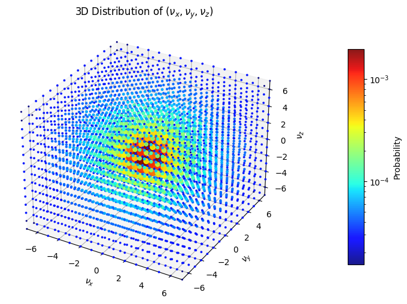{width="500" fig-align="center"}

The probability distribution clearly peaks near the origin, as expected from the theoretical scaling. To get better insight into to correctness of the result, we only plotted the $\nu_x$-values where $\nu_y$ and $\nu_z$ are zero and compare it to the desired values:

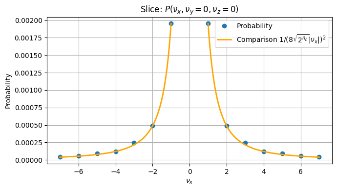{width="600" fig-align="center"}

{width="600" fig-align="center"}

There is only a very slight difference visible here for $\nu_x = 5$. For a better comparison we also plotted the relative difference between the result and the true value. Again for $\nu_y$ and $\nu_z$ fixed to zero:

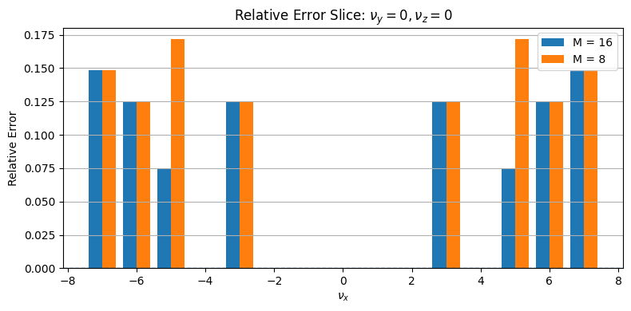{width="600" fig-align="center"}

As assumed, the only improvement here is for $\nu_x = 5$. However, when fixing $\nu_y$ and $\nu_z$ fixed to seven, more differences appear:

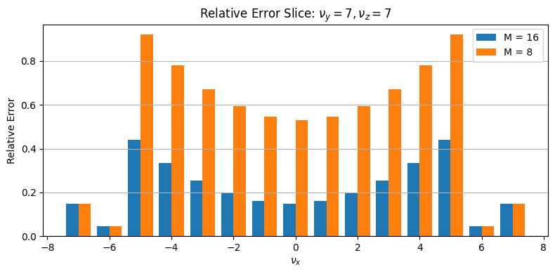{width="600" fig-align="center"}

A different picture also arises for $\nu_y$ fixed to zero and $\nu_z$ to seven:

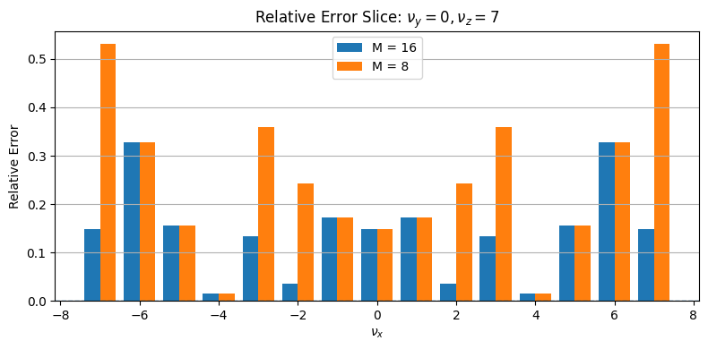{width="600" fig-align="center"}


A good way to see the improved granularity for increasing $M$ is also a 2D plot, where only the $\nu_z$ value is fixed to zero:

::: {layout-ncol="2"}
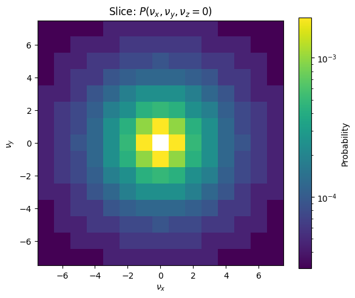

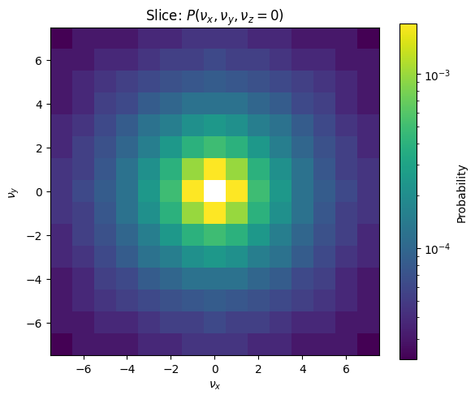
:::

Here one can see that the gradient gets smoother with the higher M. Note that with all these plots, the color gradients are scaled exponentially as the difference between the small values is hard to see otherwise.

Overall, the numerical results confirm that the circuit prepares the desired probability distribution and that increasing $M$ improves the approximation accuracy.

## Cost

For the cost analyzation of this preparation, only non Clifford gates are considered. In this case, the only non-Clifford gates used are controlled Hadamards and Toffolis or X gates with even more than two Controls. The authors translate these into all Toffoli cost where one controlled Hadamard gate has cost of one Toffoli gate. An X-Gate controlled on $k > 2$ qubits is counted as $(k - 1)$ Toffolis.

The whole preparation consists of the following steps:

1.  The preparation of the $\mu$-register as unary encoded superposition: For this we require $n_p - 1$ controlled Hadamards, as we use them on all qubits of $\mu$ except for the two least significant ones and $\mu$ consists of $n_p + 1$ qubits. Other than that we only use Hadamards for this, which are Clifford.

2.  The initialization of the $\nu$-registers: We use $3(n_p - 1)$ to reach the states including the negative zero. To then filter out the negative zeros, we need to check for each $\nu_x$, $\nu_y$ and $\nu_z$ whether they represent the negative zero, which requires for each an X gate with $n_p$ controls so, in total $3n_p$ Toffolis, and the additionally two Toffolis to combine the individual results. Altogether this makes $3(n_p - 1) + 3n_p + 2 = 6n_p - 1$ Toffolis for this step.

3.  Filter out $\nu$-values that are not in the corresponding $B_\mu$: This requires $n_p$ X gates with each four controls which results in a Toffoli cost of $3n_p$.

4.  Calculate $\nu_x^2 + \nu_y^2 + \nu_z^2$: This is implemented with a Toffoli cost of $3n_p^2 - n_p - 1$. A detailed proof for this can be found in @Su_2021 in Appendix G.

5.  Calculate $m(\nu_x^2 + \nu_y^2 + \nu_z^2)$: This can be done with a Toffoli cost of $2 \log M (2 n_p + 2) - \log M$ Toffolis. The proof for this can be found in Appendix G of @Su_2021 as well.

6.  Test the inequality $(2^{\mu - 2})^2M > m(\nu_x^2 + \nu_y^2 + \nu_z^2)$: The result from the multiplication has a size of $(2n_p + \log M + 2)$ qubits, so calculating with a comparator of this size, we will also require $(2n_p + \log M + 2)$ Toffolis for this, assuming that we don't need Toffolis for the uncomputation.

To verify these costs within our implementation, we used the tequila code and computed the Toffoli counts for different values of $n_p$ and $M$, without uncomputing any ancilla. For the first four steps mentioned, the gate counts were exactly as expected. For the multiplication and the comparison, slightly fewer gates were required than expected. This could be due to small extra optimizations, errors within the code, or errors within the gate counting. In any case, the deviations where small and the results where still within the expected order of magnitude.

Overall these steps yield a total Toffoli count of 
$$
\begin{gathered}
(n_p - 1) + (6n_p - 1) + 3n_p + (3n_p^2 - n_p - 1) + 2 \log (M) (2 n_p + 2) - \log (M) + (2n_p + \log (M) + 2) \\
= 3n_p^2 + 11n_p - 1 + 4 \log (M)(n_p + 1)
\end{gathered}
$$

Additionally, one would actually require an additional final flag that summarizes the other flags. Computing this adds three more Toffolis. The authors then calculate the cost of the inversion of this whole preparation, which is needed as well. They state that only the inversions of the $4(n_p-1)$ controlled Hadamards actually cost Hadamards again and the other gates can be inverted using Clifford gates. Thus, they add $4(n_p - 1) + 3$ to this total count which yields

$$
3n_p^2 + 15n_p - 2 + 4 \log (M)(n_p + 1).
$$

The final result in the paper is however

$$
3n_p^2 + 15n_p - 7 + 4 \log (M)(n_p + 1).
$$

Since this is only a very insignificant deviation, we did not investigate it further. The whole Toffoli gate of our implementation stays slightly below both values (before adding the extra costs).

All in all, the complexity of the preparation is therefore within $O(n_p^2 + \log (M)n_p)$.

## Success probability

The authors state that one round of amplitude amplification is always sufficient to reach a feasible success probability, regardless of the chosen $n_p$ and $M$ values. To confirm this statement, we compute the total success probability of our final state. As shown in the beginning, for each $\nu \in G_0 = [- (2^{n_p} - 1), 2^{n_p} - 1]^3 \backslash \{(0,0,0)\}$ we have a final amplitude close to $\frac{1}{8 \sqrt{2^{n_p}}} \frac{1}{\|\nu\|}$. This means that the total probability of ending up within the 'good' space is
$$
\sum_{\nu \in G_0} \left(\frac{1}{8 \sqrt{2^{n_p}}} \frac{1}{\|\nu\|}\right)^2
= \frac{1}{64 \cdot 2^{n_p}} \sum_{\nu \in G_0} \frac{1}{\|\nu\|^2}
$$

Note that $G_0$ can be rewritten as $\{ \nu \in \mathbb{Z}^3 \mid 0 < \|\nu\|_{\infty} \leq 2^{n_p} - 1\}$ where the infinity norm assigns the maximum magnitude of all entries. This set can be reinterpreted as the union of disjoint sets 
$$
\bigcup_{k = 1}^{2^{n_p} - 1} \{ \nu \in \mathbb{Z}^3 \mid \|\nu\|_{\infty} = k \}.
$$

With this we can rewrite the total probability as

$$
\frac{1}{64 \cdot 2^{n_p}} \sum_{k=1}^{2^{n_p} - 1} \sum_{\nu \in \mathbb{Z}^3, \| \nu \|_\infty = k} \frac{1}{\|\nu\|^2}.
$$

For each $k$ and each $\nu \in \mathbb{Z}^3$ with $\| \nu \|_\infty = k$ we have $k^2 \leq \| \nu \|^2 \leq 3k^2$. Further, we have

$$
|\{ \nu \in \mathbb{Z}^3 \mid \|\nu\|_{\infty} = k \}|
= (2k + 1)^3 - (2k - 1)^3 = 24k^2 + 2
$$

for each $k$, since there are always $k$ positive values, $k$ negative values and the zero possible for each of the three entries, minus the number of vectors where all entries are smaller than $k$. With this we reach a lower bound for the success probability of

$$
\begin{gathered}
\frac{1}{64 \cdot 2^{n_p}} \sum_{k=1}^{2^{n_p} - 1} \left(24k^2 + 2\right) \frac{1}{3k^2} = \frac{1}{64 \cdot 2^{n_p}} \sum_{k=1}^{2^{n_p} - 1} \left(8 + \frac{2}{3k^2}\right) \\
\geq \frac{1}{64 \cdot 2^{n_p}} \sum_{k=1}^{2^{n_p} - 1} 8 
= \frac{1}{64 \cdot 2^{n_p}} (2^{n_p } - 1) \cdot 8 \\
= \frac{1}{8} - \frac{8}{64 \cdot 2^{n_p}}
\geq \frac{1}{8} - \frac{1}{8 \cdot 2^{1}} = \frac{1}{16}
\end{gathered}
$$

This already establishes a constant success probability and therefore a constant cost for amplitude amplification. An upper bound for the success probability is

$$
\begin{gathered}
\frac{1}{64 \cdot 2^{n_p}} \sum_{k=1}^{2^{n_p} - 1} \left(24k^2 + 2\right) \frac{1}{k^2} = \frac{1}{64 \cdot 2^{n_p}} \sum_{k=1}^{2^{n_p} - 1} \left(24 + \frac{2}{k^2}\right) \\
= \frac{3}{8} - \frac{3}{8 \cdot 2^{n_p}} + \frac{2}{64 \cdot 2^{n_p}} \sum_{k=1}^{2^{n_p} - 1} \frac{1}{k^2}
\leq \frac{3}{8} - \frac{3}{8 \cdot 2^{n_p}} + \frac{2}{64 \cdot 2^{n_p}}\frac{\pi^2}{6} < \frac{3}{8}
\end{gathered}
$$

From @Brassard_2002 we know that a success probability $a$ gets amplified to a probability of $\sin^2((2m+1)\theta_a)$ after $m$ rounds of amplitude amplification, where $\theta_a = \arcsin\sqrt{a}$ and $0 \leq \theta_a \leq \pi/2$. This means that for our lower bound of $1/8$ we have $\theta_{\textbf{min}} \approx 0.361$ which results in a success probability of roughly $0.78$. The upper bound of $3/8$ with $\theta_\textbf{max}\approx 0.659$ ends up with a success probability of $0.844$. For two rounds of amplitude amplification, the upper bound overshoots and considering that the lower bound is quite a rough estimate, it can be assumed that one round of amplitude amplification is in general optimal.

## QROM

For completeness note that the preparation of $U$ and $V$ is not fully completed yet, as preparations of three further registers are required. These are less complicated to prepare, as two of them are equal superpositions, which can be implemented using plain Hadamards, and one can be implemented using Quantum Read Only Memory (QROM). We will take a brief look at the implementation of the QROM state here. The goal is to implement

$$
\frac{1}{\sqrt{\sum_l \zeta_l}} \sum_{l=1}^L \sqrt{\zeta_l} \ket{l}.
$$

Where $L$ is the number of nuclei and $\zeta_l$ the corresponding nuclear charge, hence the number of protons. The basic idea is to use a QROM, which is a way to store classical data into indexed quantum registers. The operation looks like this:

$$
\textrm{QROM}_d \cdot \sum_{l=0}^{L - 1}\alpha_l\ket{l}\ket{0} = 
\sum_{l=0}^{L - 1}\alpha_l\ket{l}\ket{d_l}
$$

where $d_l$ is the data word associated to index $l$ in a data list d. Notice that our values $\zeta_l$ are integer numbers, since they represent the number of protons of a nucleus. Now we define $\lambda_{\zeta} := \sum_l \zeta_l$ as the sum of all nuclear charges. This enables using a QROM for the state preparation. For this we use a data list containing $\lambda_{\zeta}$ indices, where each $l$ is associated with $\zeta_l$ indices. If we now use the QROM on a uniform superposition over all indices, it will result in each $l$ having a probability of $\zeta_l$ which implies an amplitude of $\sqrt{\zeta_l}$.

The questions we have to deal with now are how to implement the QROM efficiently (with linear T complexity) and how to deal with $\lambda_{\zeta}$ not being a power of two. Answers to these can be found in @PhysRevX.8.041015.

## Conclusion

The goal of this project was to implement and analyze a quantum circuit for preparing the momentum-space states used for implementing $U$ and $V$ for the electronic structure simulation algorithm. The circuit was constructed from reversible arithmetic operations, comparisons, and amplitude preparation routines, and was implemented both in Tequila and in Qulacs for numerical verification.

The numerical results confirm that the circuit prepares the desired probability distribution and that the approximation improves as the parameter $M$ is increased. At the same time, increasing the grid size parameter $n_p$ requires correspondingly larger values of $M$ in order to maintain the accuracy of the approximation.

A major practical limitation of the implementation is the large number of required qubits, which makes classical simulation difficult even for relatively small parameter values. The alternative implementation in Qulacs allowed larger instances to be studied, but realistic parameter regimes remain out of reach for classical simulation.

Overall, the results demonstrate that the proposed circuit correctly implements the intended state preparation and behaves as predicted by the theoretical analysis. The construction provides a concrete realization of the algorithmic ideas and illustrates both the feasibility and the resource requirements of this approach.

## References

::: {#refs}
:::

The bibliography uses a citation style file from the CSL project: <https://citationstyles.org/>