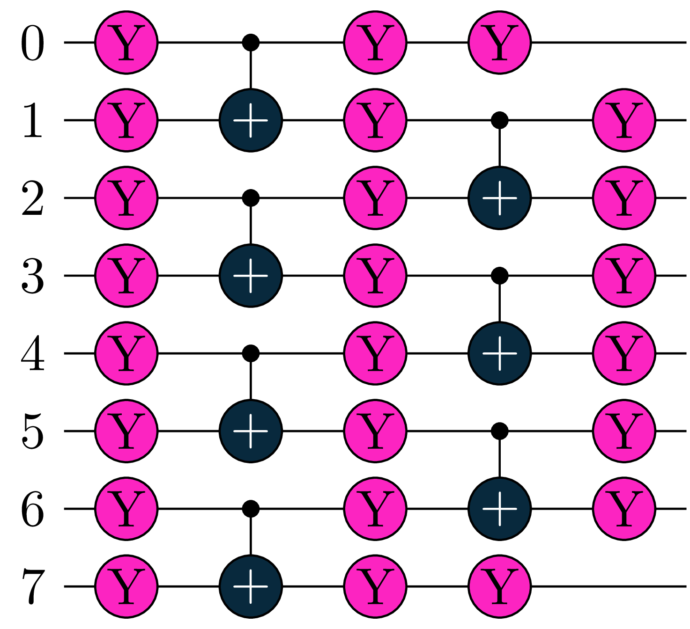
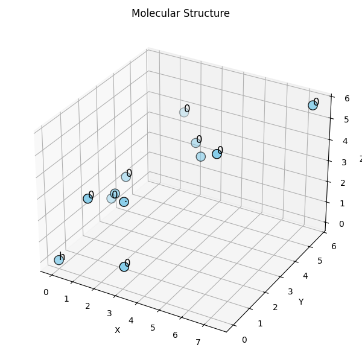
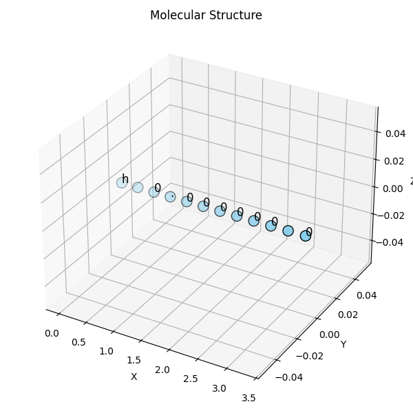
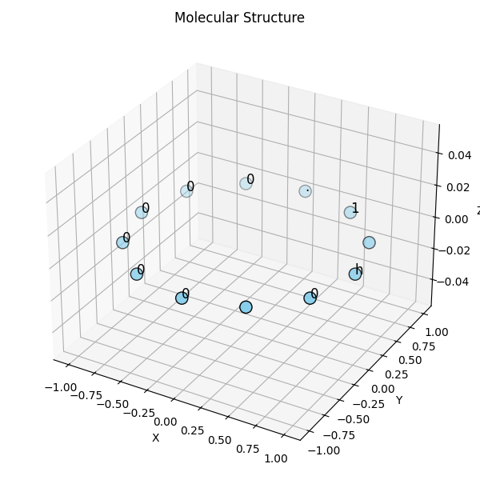
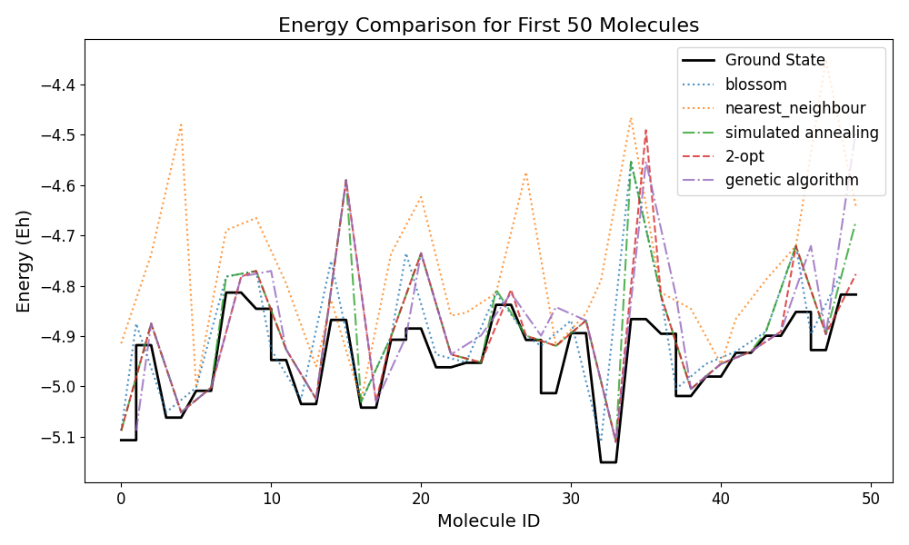

---
title: "quanti-gin: Benchmarking VQE optimization methods against the SPA"
author:
    - name: Korbinian Stein, Viktoria Raba
      id: ks
      email: korbinian.stein@uni-a.de, viktoria.raba@uni-a.de
date: "2026-09-16"
image: "preview_output-circuit.png"
categories: [code]
format:
   html:
      toc: true
   pdf:
      pdf-engine: xelatex
---

## Introduction

Working in the quantum domain, we often lack good tools to compare and benchmark against state-of-the-art optimization methods. Benchmarking, requires large amounts of reference data for statistically significant comparisons, so we introduce a configurable data generator which can be used to create large sets of hydrogenic test systems and their corresponding energies, with a focus on allowing quick and easy plug-in testing of custom optimization methods. In the following, we introduce the data generator quanti-gin (available at: <https://github.com/nylser/quanti-gin>) and illustrate how to use and customize it.
The Separable Pair Ansatz (SPA) provides a structured approach for constructing such variational states. An important part of the SPA initialization is the choice of edges, where each edge connects two orbitals that form a separable pair.
For a system with an even number of atoms, the initialization problem can therefore be formulated as a graph matching problem. The Quanti-Gin framework was extended by a few graph matching heuristics and suitable bechmarking and visualisation tools.
The implemented SPA initialization strategies include:

    - brute force
    - nearest insertion
    - 2-opt
    - simulated annealing
    - genetic algorithm
    - minimum weight perfect matching (blossom)
    - scaled blossom 
    - ant colony optimization

## Installation

### Prerequisites for the quanti-gin

quanti-gin can easily be installed via `pip install quanti-gin` in your preferred python environment or with your preferred python package manager. This will install the data generator and its dependencies.

## Data generator & visualization

For the generation and analysis of data, we introduce: 1) a parameterizable data generator for the synthesis of data, and 2) a jupyter notebook that can be used to inspect the features & quality of the data, as well as 3) an experimental machine learning application notebook.

### Data generator

We define `DataGenerator` class and associated functions to generate and optimize examples of hydrogen molecules using the Tequila package. Here is a summary of the main functionalities:

1.  **Data Classes and Initialization**:
    - **Job Dataclass**: A data structure that stores information about a DataGenerator job, including geometry, edges, guesses, coordinates, and distances.
2.  **Geometry and Coordinate Generation**:
    - **generate_geometry_string**: Creates a string representation of molecular geometry from coordinates.
    - **generate_coordinates**: Generates a set of coordinates for atoms in a molecule, ensuring a minimum distance between atoms to avoid generating infeasible data.
3.  **Optimization and Reference Computation**:
    - **run_optimization**: Optimizes the molecular geometry molecule and calculates energies.
4.  **Job Generation and Execution**:
    - **generate_jobs**: Creates a list of molecular jobs with varying geometries, edges, and guesses.
    - **execute_job**: Runs the optimization for a single job.
    - **execute_jobs**: Runs the optimization for a list of jobs, displaying progress.
5.  **Result Processing**:
    - **create_result_df**: Generates a DataFrame from job results, including optimized energies, exact energies, and coordinates.
6.  **Main Execution**:
    - The `main` function parses command-line arguments, sets up job generation and execution, evaluates results, and saves the final data to a CSV file.

The code is structured to generate molecular geometries, perform quantum chemistry calculations, and analyze results efficiently, leveraging parallel processing and progress tracking with `tqdm`.
Note that the `run_spa_optimization` function was adapted and now calculates `tq.simulate()` based on the angles of the molecule instead of `tq.minimze()`. 
The ant colony optimization heuristic is not included for DataGenerator use, but it is provided in a seperate file and can be used to generate an initial guess as well.
All of the other initialization heuristics can be found in the `shared.py` file.

### Usage Instructions

1.  **Basic Command to Generate Jobs and Results**: Run the data generator for one of the built in methods with the following command-line arguments:

    ``` sh
    python -m quanti_gin [--method {fci,spa}] [--output <output_file>] <number_of_atoms> <number_of_jobs>
    ```

    - `--method {fci,spa}` (optional): Specify the method to choose one of the built-in methods.
    - Alternative built-in methods for spa calculation: 
                `spa_brute_force`, `spa_nearest_insertion`, `spa_two_opt`, `spa_simulated_annealing`, `spa_genetic_algorithm`, `spa_minimum_weight_perfect_performance`, `spa_scaled_blossom`
    - `--output <output_file>` (optional): Specify the name of the output file to save results.
    - `<number_of_atoms>`: Number of atoms in the molecules (must be an even number).
    - `<number_of_jobs>`: Number of molecular jobs to generate and process.

    Example:

    ``` sh
    python -m quanti_gin 4 100 --output results.csv
    ```

    This will run the data generator with 100 jobs for a molecule with 4 atoms, using the default method (SPA) and save the results to `results.csv`.

2.  **Compare with custom methods and FCI** To compare multiple built-in methods with a custom method, use the following command:

    ``` sh
    python -m quanti_gin --compare-to fci,spa --custom_method <path_to_method.py> <number_of_atoms> <number_of_jobs>
    ```

    - ``` --compare-to fci, spa, spa_brute_force, spa_nearest_insertion, spa_two_opt ```, 
    ```spa_simulated_annealing, spa_genetic_algorithm, spa_minimum_weight_perfect_performance, spa_scaled_blossom```: Specify the methods to compare with the custom method.
    - `--custom_method <path_to_method.py>`: Specify the path to the custom method file.
    - `<number_of_atoms>`: Number of atoms in the molecules (must be an even number).
    - `<number_of_jobs>`: Number of molecular jobs to generate and process.

    This will run the data generator with 100 jobs for a molecule with 4 atoms, every job will be calculated with the custom method, the FCI method, and the SPA method.

### Available SPA Initialization Strategies

**Brute force:**
Finds an optimal pairing via exhaustive search.

**Nearest Neighbour:**
A locally optimal solution to the edge generation problem, where it always considers the next possible shortest edge.

**Nerarest Insertion:**
Starts with a subtour that consists of edges. Inserts one new edge at every step.

**2-opt:**
Local search heuristic that replaces two old edges with two new edges.

**Simulated annealing:**
Meta-heursitc that explores a solution graph by a random walk. Each move is accepted based on a Metropolis criterion. Improvements are always kept, while deteriorations are kept with a certain probability. 

**Genetic Algorithm:**
Evolutionary algorithm based on population search method and natural selection. Candidate solutions evolve over successive generations through selection, crossover and mutation.

**Blossom:**
Exact method for computing a maximum matching in a general undirected, unweighted graph. It repeatedly locates augmenting paths and flips matched or unmatched edges along such a path to increase the matching size by one. 

**Scaled Blossom:**
Same as the regular blossom algorithm, but uses a scaled distance matix as input. The scaling is computed over all matrix entries with the formula:
$$
D^{\mathrm{scaled}} =
\tanh\left(\frac{\pi}{2}D\right)
$$

**Ant Colony Optimization:** 
Metaheuristic inspired by ants, where multiple artificial ants construct solutions by following paths with high pheromone levels while also considering problem-specific heuristic information. 
After each iteration, pheromone is reinforced on paths belonging to good solutions and gradually evaporates, causing the algorithm to increasingly favor promising paths.

### Adapted SPA Initialization Strategies

To explore whether soutions that the heuristics did not calculate as the best, but rather one of the n-th best yields a more optimal solution, a few of the algorithms were modified to calculate more than one solution.
Among those are genetic algorithm, simulated annealing, 2-opt, blossom and scaled blossom.
The adapted algorithms can be found in the spa_best_n_solutions subsection in the quanti-gin git repo. 

### Creating a custom optimization method for comparison

As an example, we can create a custom optimization method that uses a different optimization algorithm or circuit structure. To do this, we can create a new python file with the custom optimization method and can then pass it to the `--custom_method` argument.

First, we initialize our Hamiltonian and Ansatz circuit. Make note that we are only getting the molecule as an input, which is a `QuantumChemistryBase` object from tequila. Using the molecule, one can easily get the geometry, basis set, and other information needed for the optimization, so there is no need to use tequila for the optimization itself.

``` python
import tequila as tq
from tequila.quantumchemistry import QuantumChemistryBase

    def run_optimization(mol: QuantumChemistryBase, *args, **kwargs):
        H = mol.make_hamiltonian()

        U = tq.gates.QCircuit()
```

Now, for building the circuit, we populate the circuit `U`, using a structural approach:

``` python

        # structure of the ansatz:
        # 1. Ry rotations on all qubits
        for i in range(len(coordinates) * 2): # <1>
            U += tq.gates.Ry(target=i, angle="a" + str(i)) # <1>
        depth = 2
        # 2. Entangling layer => Alternating: CNOTs on even and odd qubits
        # 3. Ry rotations on all qubits
        for d in range(depth): # <2>
            offset = d % 2
            iterations = len(coordinates) * 2
            for i in range(0, iterations - 1 - offset, 2): # <3>
                U += tq.gates.CNOT(control=offset + i, target=offset + i + 1) #<3>
            for i in range(iterations): # <4>
                U += tq.gates.Ry(target=i, angle=f"b{d}_{i}") # <4>
```

1.  Add an Ry rotation gate for all qubits we need to represent the atoms of the molecule.
2.  Repeat while configured depth is not reached:
3.  Add entangling layer: CNOTs alternating on even/odd qubits per iteration
4.  Add Ry rotation on all qubits

The resulting circuit with the configured `depth = 2` for 4 H-atoms is illustrated in @fig-circuit.

{#fig-circuit width="400" fig-align="center"}

``` python
    E = tq.ExpectationValue(H=H, U=U) # <1>
    result = tq.minimize(E, silent=True) # <2>
    return {
        "energy": result.energy,
}
```

1.  Create an expectation value `E` with our previously obtained Hamiltonian `H` for the molecule, and constructed circuit `U`.
2.  run the minimization algorithm for that expectation value via tequila.

The only requirement for the custom method is that it returns a dictionary in the form:

``` python
{
    "energy": result.energy,
}
```

This concludes the introduction of custom methods for the quanti-gin DataGenerator. If you desire to customize more or different aspects, you can use a subclass of the `DataGenerator` class and override the methods you want to change. Looking at the source code of quanti-gin <https://github.com/nylser/quanti-gin> always is a good reference and starting point.

## Benchmarking on different molecule structures

It is possible to choose a set structure for molecules. This includes geometries where the atoms are randomly distributed within a three dimensional space, a linear arrangement of atoms and ring shaped placement. 
{#fig-circuit width="250" fig-align="center"}
{#fig-circuit width="250" fig-align="center"}
{#fig-circuit width="250" fig-align="center"}

For the linear structure, the axis in the three dimensional space can be chosen. For ring molecules, the radius at the beginning can be chosen. The distances between the atoms will increase with each iteration for linear and ring shaped molecules. To run a set of molecules for benchmarking use:

```         
run_benchmark(<number_of_atoms>, <number_of_jobs>)

run_benchmark_for_linear_molecules(<number_of_atoms>, <number_of_jobs>, axis="x", base_spacing=0.25)

run_benchmark_for_ring_molecules(<number_of_atoms>, <number_of_jobs>, radius=1, radius_increase=0.25)
```
All of those benchmarking functions compare the performance of the different graph methods and calculate the following results:

        "method": name, (name of the used method)
        "energy": energy, (calculated energy based on edge initialization from corresponding method)
        "edges": edges, (edge configuration used)
        "runtime": runtime, (amout of time heuristic needed to calculate edges)
        "ground state energy": ground_state_energy, (fci ground state energy)
        "energy gab": energy_gap, (calculated energy - ground state energy)

The results will be stored in a csv file named "benchmark_results\_..."

## Data Visualization

The quanti-gin repository includes a Jupter Notebook for visualizations and analysis of the generated data.

### Data Visualization Example

```{python}
#| echo: false
!pip install quanti-gin
```

If you just want to visualize the different methods and their results, you can use the following code.

Setup and load the data:

```{python}
from pathlib import Path
import matplotlib.pyplot as plt
import numpy as np
import random

from quanti_gin.shared import (
    read_data_file,
)

data = read_data_file(Path("./example_data.csv"))
```

Now, `data.df` contains the data in a pandas DataFrame, which can be used for visualization and analysis. As our example data compares multiple methods against each other, we can group the data by the method and visualize the results.

```{python}
grouped_methods = data.df.groupby("method")
method_names = grouped_methods.groups.keys()

# boxplot of custom_energy and fci, and SPA energy
fig, axes = plt.subplots(
    1, len(grouped_methods), sharey=True, figsize=(9, 5), layout="constrained", squeeze=False
)

fig.suptitle("Method energies")

fig.set_figheight(fig.get_figheight())
for i, (axis, (method_name, method)) in enumerate(zip(axes.flatten(), grouped_methods)):
    axis.boxplot(method.optimized_energy)
    axis.set_title(method_name)

plt.show()
```

To compare all the different methods to each other, we can use this example plot:

```{python}
combinations = []
for method_a in method_names:
    combinations.append(
        [(method_a, method_b) for method_b in method_names if method_a != method_b]
    )

for comb_list in combinations:
    fig, axes = plt.subplots(
        1, len(method_names) - 1, sharey=True, figsize=(10, 5), layout="constrained"
    )
    fig.suptitle(f"{comb_list[0][0]}")
    for plot, (a, b) in zip(axes, comb_list):
        energy_a = np.array(grouped_methods.get_group(a).optimized_energy)
        energy_b = np.array(grouped_methods.get_group(b).optimized_energy)
        error = np.abs(energy_a - energy_b)

        plot.boxplot(abs(energy_a - energy_b), tick_labels=[f"{a} vs. {b}"])

plt.show()
```

### Data Visualization for special structures and methods\` performance

For the different structures an alternative function for visualization is also available.

This focuses more on the performance of different methods. To choose which methods should be shown in the plots, provide their names as a list. If the list is None, all of the heuristics above, except for ant colony, are shown. An example code is shown below.
       
    benchmarking_data_visualize_matplotlib("<name-of-csv-file>.csv")

Multiple plots are generated by using the following code:

```
from quanti_gin.benchmarking_and_structures import run_benchmark
from quanti_gin.visualization_for_benchmarking import benchmarking_data_visualize_matplotlib

run_benchmark(num_atoms=10, num_jobs=50)

benchmarking_data_visualize_matplotlib("benchmark_results_10.csv",
                                        methods_to_plot=["blossom", "nearest_neighbour", "simulated annealing", "2-opt", "genetic algorithm"],
                                        show_first_n_molecules=50)
```

One of those plots is shown below. It represents the heuristics` performance on reaching the ground state.

{#fig-circuit width="600" fig-align="center"}

For more detailed analysis and visualization, you can use the provided Jupyter Notebook in the quanti-gin repository.

## New geometries

Aside from hydrogen molecules, it is now possible to use the geometries of actual molecules for benchmarking.

Aside from fci and spa, hf and ccsdt energies can also be computed.

For more information visit the quanti-gin/external/spa-benchmark subsection in github.

````{=html}
<!-- ## Prerequisites for Machine Learning and Visualization Jupyter Notebooks
To use and visualize the data that quanti-gin generates there are two example Jupyter Notebooks, one for a basic Neural Network training approach, and one for visualizing and analyzing the data that was generated by quanti-gin.

These notebooks have specific prerequisites, the simplest way of installing the required packages is using the python [conda](https://docs.conda.io/en/latest/) `environment.yaml`, which includes all dependencies.

Once a version of conda is installed (we recommend [miniconda](https://docs.anaconda.com/free/miniconda/), for a lightweight, well contained installer), you can proceed with installation and creation of the conda environment.

Create the conda environment based on the environment.yaml file:
```sh
conda env create
```
After this, a new environment called metavqes should exist, that you can activate using:
```sh
conda env activate metavqes
```

Then, you can open either of the notebooks to look at data usage and visualization examples:

- [Visualization](../Visualization.ipynb)
- [NeuralNetwork](../NeuralNetwork.ipynb) -->
````
